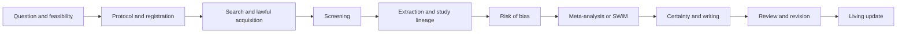

<p align="center">
  
</p>

<h1 align="center">MetaWingman</h1>

<p align="center"><b>Design the review question and synthesis method together, then carry evidence through an auditable, human-accountable workflow.</b></p>

<p align="center">Question-first, evidence-grounded systematic reviews and meta-analysis.</p>

<!-- readme-metrics:start -->
[](LICENSE)
[](https://github.com/fsy2004/MetaWingman/releases)


<!-- readme-metrics:end -->

[English](#what-it-is) · [中文](#中文说明) · [Documentation](docs/README.md) · [Current status](docs/STATUS.md) · [Security](SECURITY.md)

## Live repository snapshot

<!-- readme-inventory:start -->
| Repository metric | Current |
|---|---:|
| Python entry points | 87 |
| JSON schemas | 87 |
| R analysis modules | 26 |
| R adapter manifests | 61 |
| R adapters | 15 |
<!-- readme-inventory:end -->

The snapshot is generated from canonical sources by
[`scripts/update_readme.py`](scripts/update_readme.py). GitHub Actions checks it
on every push and pull request.

## What it is

MetaWingman is a portable, host-model agent skill for biomedical systematic
reviews, scoping reviews, evidence maps, rapid reviews, living reviews, and
meta-analysis. It turns a review into typed scientific state: a protocol,
source and study lineage, decision records, deterministic analysis inputs,
verification results, and accountable release gates.

The skill runs on the model already available to the host agent. It does not
require a second model account. Database access, licensed full text, and other
credentialed services remain separate user-controlled capabilities.

## What is implemented

- **Question–method co-design.** Clinical question fields, estimands, eligible
  designs, and synthesis routes are constructed and checked together.
- **Stage-gated review state.** Typed actions and validators cover feasibility,
  protocol, search, screening, extraction, appraisal, synthesis, certainty,
  writing, and updates.
- **Evidence provenance.** Records preserve
  `record → report → study → result → claim` lineage, source anchors, hashes,
  licenses, corrections, and retractions.
- **Deterministic analysis.** The bundled R toolkit recalculates effect sizes
  and supports pairwise, diagnostic, network, proportion, dose-response,
  Bayesian, influence, heterogeneity, and sequential-analysis adapters.
- **Guarded AI execution.** Proposal–opposition–judge calls are test-time
  computation. Deterministic source and executable checks gate high-risk
  outputs, and the system can abstain.
- **Sealed evaluation and bounded training.** Family-isolated cases, immutable
  plans, receipts, locks, weak-label boundaries, and server preflight contracts
  support reproducible component development.

## Validation status

The latest locked question–method study completed 225 AI-only runs across
development, calibration, and held-out splits. On held-out cases, biomedical
routing produced 2 correct, 6 partial, and 7 critical-error runs; the guarded
full package produced 2 correct, 5 partial, 2 critical-error, and 6 abstained
runs. Both prespecified joint-success contrasts were small and statistically
inconclusive with five case clusters.

This is a feasibility and capability-enablement result. It does not establish
complete-review accuracy, false-exclusion safety, human replacement, labor
savings, clinical benefit, or an independent verifier effect. One trained
retrieval component also failed global development retrieval and remains a
documented negative result.

Read the [current status](docs/STATUS.md) and the
[R5 feasibility report](docs/architecture/question-synthesis-r5-feasibility-report-2026-08-21.md)
before citing a capability.

## Quick start

### Install as a Codex plugin

```powershell
codex plugin marketplace add fsy2004/MetaWingman
codex plugin add metawingman@metawingman-local
```

### Clone the repository

```powershell
git clone https://github.com/fsy2004/MetaWingman.git
cd MetaWingman
.\install.ps1
```

Then give the skill a review question, current stage, and available material:

```text
$metawingman

Review question: ...
Current stage: topic / protocol / search / screen / extract / appraise / analyze / write / update
Available material: protocol, searches, RIS/CSV, PDFs, extraction tables, or analysis data
Required output: decision record, reproducible project, tables, figures, GRADE, manuscript, or audit
```

Deterministic ZIP files and SHA-256 checksums are published through
[GitHub Releases](https://github.com/fsy2004/MetaWingman/releases).

## Review workflow



MetaWingman prepares auditable work first. Humans retain final responsibility
for protocol freeze, credentialed access, eligibility decisions required to be
independent, extracted values, risk-of-bias judgments, poolability and model
choice, certainty ratings, conclusions, and submission.

## Repository layout

```text
MetaWingman/
├── metawingman/               # canonical Skill source
│   ├── SKILL.md
│   ├── references/
│   ├── schemas/
│   └── scripts/
├── toolkit/R/                 # deterministic meta-analysis modules
├── .agents/skills/            # generated agent bundle
├── plugins/metawingman/       # generated Codex plugin
├── docs/                      # status, methods, reports, and runbooks
├── research/                  # public registries, plans, and frozen snapshots
├── tests/                     # contracts and regression tests
└── scripts/                   # build, verification, release, and README tools
```

Edit `metawingman/` and `toolkit/`, then rebuild the generated distributions.
Do not hand-edit `.agents/skills/` or the generated plugin Skill.

## Development

```powershell
python -m unittest discover -s .\tests -p "test_*.py" -v
python .\metawingman\scripts\test_r_adapters.py .\metawingman
python .\scripts\build_skill_bundle.py
python .\scripts\verify_skill_bundle.py .\.agents\skills\metawingman
python .\scripts\verify_skill_bundle.py .\plugins\metawingman\skills\metawingman
python .\scripts\verify_dependency_locks.py
python .\scripts\update_readme.py --check
```

Passing tests establish the tested software contract in the current
environment. They do not validate a review's scientific conclusion.

## Documentation

- [Documentation map](docs/README.md)
- [Methodology-grounded evaluation contract](docs/architecture/methodology-grounded-evaluation-contract.md)
- [Clinical question and synthesis co-design](docs/architecture/clinical-question-synthesis-co-design.md)
- [Server mainline runbook](docs/architecture/server-mainline-runbook.md)
- [README writing and maintenance](docs/README_MAINTENANCE.md)
- [Research asset policy](research/README.md)
- [Privacy](PRIVACY.md), [acceptable use](ACCEPTABLE_USE.md), [security](SECURITY.md), and [support](SUPPORT.md)

---

## 中文说明

MetaWingman 是一个面向生物医学系统综述与 Meta 分析的可移植 Agent
Skill。它把研究问题、方案、来源、筛选、提取、偏倚风险、统计综合、GRADE、
写作和持续更新组织为类型化状态与可审计门禁，而不是一组互不关联的提示词。

Skill 使用宿主 Agent 已有的模型，不要求额外模型账号。商业数据库、机构全文、
CAPTCHA 和其他凭据能力继续由用户控制。

### 核心能力

- **问题与方法联合设计：** 同时约束临床问题、estimand、合格研究设计和综合路线。
- **阶段门禁：** 每个阶段保留输入契约、验证结果、偏离和人工责任。
- **证据谱系：** 维护 `记录 → 报告 → 研究 → 结果 → 主张`，并保存来源锚点、
  哈希、许可、勘误与撤稿状态。
- **确定性统计：** 26 个 R 模块及其 adapter 覆盖常用效应量和多类 Meta 分析。
- **受约束的 AI 执行：** 多角色调用只算 test-time compute；高风险输出必须通过
  来源和可执行验证，否则弃权。
- **封存评测与有界训练：** 按综述家族隔离数据，冻结计划、回执、锁和弱标签边界。

### 当前证据

最新问题—方法 R5 评测完成 225 次锁定运行。留出集中，生物医学路由得到
2 次正确、6 次部分正确和 7 次关键错误；完整受约束配置得到 2 次正确、
5 次部分正确、2 次关键错误和 6 次弃权。五个病例簇不足以支持确定性效力结论。

因此，当前证据只支持问题—方法路由和受约束发布的可行性信号。它不能证明
完整综述准确性、遗漏研究安全、人类替代、节省工时、临床获益或 verifier 的
独立作用。一个证据检索组件在全局开发集上表现很差，该负结果已保留。

引用能力前请先阅读[当前状态](docs/STATUS.md)和
[R5 可行性报告](docs/architecture/question-synthesis-r5-feasibility-report-2026-08-21.md)。

### 快速开始

```powershell
git clone https://github.com/fsy2004/MetaWingman.git
cd MetaWingman
.\install.ps1
```

```text
$metawingman

研究问题：……
当前阶段：选题 / 方案 / 检索 / 筛选 / 提取 / 评价 / 分析 / 写作 / 更新
已有材料：方案、检索式、RIS/CSV、PDF、提取表或分析数据
期望输出：决策记录、可复现项目、表图、GRADE、稿件或审查报告
```

MetaWingman 先生成可复查工作，再进入人工确认。方案冻结、需要独立完成的
纳入判断、关键提取值、偏倚风险、是否合并、统计模型、证据确定性、结论和投稿
责任仍由人类承担。

### 开发与维护

`metawingman/` 和 `toolkit/` 是权威源码；`.agents/skills/` 与 `plugins/`
是生成分发包。README 的动态徽章和仓库清单由
[`scripts/update_readme.py`](scripts/update_readme.py) 更新，GitHub Actions 在每次
push 和 pull request 时检查漂移。完整规则见
[README 写作与持续更新规范](docs/README_MAINTENANCE.md)。

## Contributing and license

Search existing [issues](https://github.com/fsy2004/MetaWingman/issues) and pull
requests before starting a change. Keep scientific claims next to their
evidence report, preserve frozen artifacts, and run the development checks.

Code in this repository uses the [MIT License](LICENSE). R packages, databases,
full text, and external methods retain their own licenses and terms.
