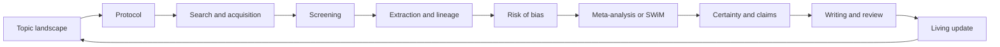

<h1 align="center">MetaWingman</h1>

<p align="center"><b>A systematic-review and meta-analysis Agent + Skill that turns review work into question formation, methodological reasoning, verification, and self-improving evidence synthesis.</b></p>

<p align="center">
  <a href="#install-and-get-started">Install</a> ·
  <a href="#why-metawingman">Why</a> ·
  <a href="#what-you-can-build">What you can build</a> ·
  <a href="docs/README.md">Documentation</a> ·
  <a href="docs/STATUS.md">Scientific status</a> ·
  <a href="#中文说明">中文</a>
</p>

<!-- readme-metrics:start -->
[](LICENSE)
[](https://github.com/fsy2004/MetaWingman/releases)


<!-- readme-metrics:end -->

## Why MetaWingman

Most review automation stops at a task: retrieve records, screen abstracts,
extract fields, or draft prose. MetaWingman is aimed at a stronger agent story:
it should ask the review question, explain why that question matters, challenge
itself with disconfirming evidence, verify the steps that would change a
conclusion, and keep the lessons as reusable method behavior. It carries one
typed review state from topic selection and protocol design through search,
screening, extraction, appraisal, meta-analysis, certainty, reporting, and living
updates.

The project is distributed in two forms:

- **Agent:** executes the review workflow with the host model, deterministic tools,
  state transitions, verifiers, and abstention.
- **Skill:** supplies the reusable methodology, schemas, scripts, review-profile
  contracts, and responsibility gates that make the workflow portable across hosts.

## Method Story

The original MetaWingman idea is preserved as four coupled agent behaviors:

- **Review Question Certificate:** convert clinical uncertainty into a structured
  question certificate with primitives, assumptions, mechanism or decision model,
  evidence tension, minimal decisive test, expected observations, and failure
  update rules.
- **Socratic stage reflection:** before each stage, ask the methodological
  questions a strong reviewer would ask; after each stage, record what failed,
  what changed, and what should be learned.
- **Step-level verification:** decompose screening, extraction, appraisal,
  synthesis, certainty, and claims into verifiable steps rather than trusting a
  fluent answer.
- **Meta-update loop:** turn verified failures and repairs into versioned Skill,
  prompt, verifier, and training improvements.

Those behaviors are implemented through two paper-facing control loops:

### 1. Clinical question and synthesis co-design

MetaWingman builds a time-bounded evidence landscape before protocol freeze. It
turns gaps, discordance, update signals, priorities, and cross-domain links into
operational review questions, while jointly choosing the review family, estimand,
effect measure, and synthesis route. A strong candidate carries a decision
tension, minimal decisive question, method guardrail, missingness anchor,
disconfirmation plan, and portfolio role.

### 2. Source-grounded full-review operating loop

During a review, MetaWingman links unresolved protocol criteria to the claims they
can change. Residual risk, downstream claim impact, and asymmetric harm determine
the next source, query, full-text, screening, verifier, compute, stopping, or
abstention action. The action is executed, verified, used to recompute the review
state, and then replanned.

These method loops share an executable substrate:

- question and synthesis-method co-design;
- `record → report → study → result → claim` lineage;
- hash-addressed protocols, evidence, analyses, and living updates;
- source anchors and deterministic executable checks;
- a bundled R engine for reproducible meta-analysis;
- sealed evaluation plans, receipts, locks, and family-isolated training.

## One review state across the lifecycle



Every accepted transition has a typed input, a validator, an evidence anchor, an
output hash, and a downstream consequence. High-risk scientific decisions can be
blocked or returned for accountable human action instead of being silently accepted.

## Install and get started

MetaWingman ships as **one method** in **two installable forms**. Both run the same
versioned methodology, schemas, deterministic R engine, and responsibility gates;
the only difference is how your host discovers and executes them.

| | **Agent plugin** | **Portable Skill** |
|---|---|---|
| What you get | An Agent that inspects live review state, calls tools, enforces gates, and continues the workflow | Auditable instructions, schemas, scripts, R engine, and gates you load as a local Skill |
| Best for | A Codex Agent-driven review you want to hand off and resume | Any Skills-compatible host, or a reproducible, inspectable workflow |
| Install | `codex plugin marketplace add fsy2004/MetaWingman` then `codex plugin add metawingman@metawingman-local` | `git clone https://github.com/fsy2004/MetaWingman.git` then `cd MetaWingman` then `.\install.ps1` |
| Invoke | Ask the Agent to use `$metawingman` with your review objective | Type `$metawingman` and supply the review state |

### Agent route: install the MetaWingman Agent

Use this route when you want a Codex Agent to discover MetaWingman, read the live
review state, call its tools, enforce scientific gates, and keep the workflow
resumable between sessions.

```powershell
codex plugin marketplace add fsy2004/MetaWingman
codex plugin add metawingman@metawingman-local
```

Give the Agent the review objective and whatever material you already have:

```text
Use $metawingman to continue this systematic review from its live project state.
Review question: ...
Current stage: topic / protocol / search / screen / extract / appraise / analyze / write / update
Available material: protocol, searches, RIS/CSV, PDFs, extraction tables, or analysis data
Required output: decision record, reproducible project, tables, figures, GRADE, manuscript, or audit
```

The Agent identifies the current stage, checks which gate is next, and produces
auditable output that another compatible Agent can resume.

### Skill route: install the portable Skill

Use this route for Codex or any other Agent Skills-compatible host when you want the
methodology itself as a local, inspectable, versioned Skill rather than a hosted
plugin. This is the route that makes the workflow reproducible and portable.

```powershell
git clone https://github.com/fsy2004/MetaWingman.git
cd MetaWingman
.\install.ps1
```

Invoke the installed Skill with the scientific state you already hold:

```text
$metawingman

Review question: ...
Current stage: topic / protocol / search / screen / extract / appraise / analyze / write / update
Available material: protocol, searches, RIS/CSV, PDFs, extraction tables, or analysis data
Required output: decision record, reproducible project, tables, figures, GRADE, manuscript, or audit
```

You can begin at any stage. MetaWingman inspects the project, identifies the next
gate, and returns auditable work that can be resumed by another compatible Agent.

## What you can build

| Goal | MetaWingman output |
|---|---|
| Choose a review or update | evidence landscape, overlap map, opportunity dossier, decision record |
| Freeze a protocol | typed review question, estimand, eligibility, outcomes, analysis and update policy |
| Run a reproducible search | source-specific strategies, exports, hashes, deduplication and acquisition state |
| Screen and extract | criterion-level dossiers, source anchors, report-study-result lineage |
| Appraise evidence | result-level risk-of-bias dossiers and synthesis-level missing-evidence state |
| Run meta-analysis | frozen analysis manifest, deterministic R output, diagnostics and sensitivity analyses |
| Write and update | certainty-linked claims, manuscript assets, reviewer audit and change-impact rerun plan |

MetaWingman supports intervention, diagnostic, prognostic, prevalence, harms,
network, dose-response, IPD, prediction-model, living, scoping, rapid, and other
review profiles through native routes, profile-guarded generic routes, or explicit
external-tool handoffs. See the [current status](docs/STATUS.md) for the live depth
and validation level of each capability.

## Scientific evidence

Software coverage, component performance, locked AI-only feasibility, published
reconstruction, and prospective scientific validation are reported as different
evidence levels. The current dated evidence includes:

- a machine-audited ten-stage lifecycle and review-profile routing contracts;
- a locked 225-run question-and-method feasibility benchmark;
- deterministic R adapter reconstruction and change-impact replay;
- family-isolated component training with immutable server receipts, including
  the [three-seed full-pool retrieval evaluation](docs/architecture/retrieval-v4-asymmetric-medcpt-results-2026-08-21.md); and
- method-agent training after restoring the Skill-driven four-mechanism contract:
  a same-family protocol-method bootstrap improved complete-method-action
  accuracy from 0.000 to 0.750, and a multi-family protocol-action run improved
  complete-method-action accuracy from 0.000 to 0.975 over 200 development
  examples from 53 families, with method-trace completeness improving from
  0.000 to 1.000. These are strong development signals that the restored
  Review Question Certificate / Socratic reflection / step-verification /
  meta-update behavior is learnable, not full ten-stage review efficacy. See the
  [method-agent training report](docs/architecture/method-agent-training-results-2026-08-22.md); and
- a frozen, family-held-out, matched-budget method-action test set was additionally attempted but produced zero examples because most remaining review families use flat JATS structure (method subsections are siblings of the "Methods" container), so the same plan cannot supply a fresh frozen method-action test set under the exact training extraction. This is recorded as a negative structural finding in the evidence ledger, and the family-held-out result (receipt `c3eee98cd1cab8c8c93daca57ec76a93d453f6c9b21910f9cbad88ba8fca387f`) remains the primary frozen, matched-budget, family-isolated evidence; and
- a training-corpus-bound representative-case registry, currently with zero
  uncontaminated confirmatory held-out cases, plus an agent-trajectory **export
  governance** contract that restricts future training exports to development
  cases and explicitly verified stages, separates positive demonstrations,
  scientific negative decisions, justified abstentions, and audit-only
  infrastructure quarantines, retains failures and abstentions, and forbids
  published-reference fields; and a [three-seed protocol-agent development
  bootstrap](docs/architecture/protocol-agent-distillation-bootstrap-results-2026-08-22.md)
  in one authoritative adult-depression review family. The unadapted base scored
  0.000 mean complete-action accuracy on four action-group-held-out spans and the
  LoRA students scored 0.917, with JSON validity 1.000 for both. This is a
  same-article development signal, not unseen-family or complete-agent evidence;
- a [broad-query topic-opportunity diagnostic](docs/architecture/topic-opportunity-direct-results-2026-08-22.md)
  that retains the negative concept-contaminated runs, blocks their topic-stage
  distillation, and adds a 100%-coverage JAMA Pediatrics development run whose
  locked screen-use candidate passed the corrected study-design-adaptive audit
  only in an explicitly post-lock calibration replay, plus a locked Lancet
  antidepressant held-out **legacy shared-candidate ranking-and-gating** result
  that predates and fails the current record-level construct contract. The
  full policy hit the target at Top-1/Top-3 while three direct rankings missed
  at Top-3; candidate generation was common to all arms and therefore untested,
  false opportunities were defined by gates that also belong to the full
  policy, and the old corpus lacks complete record-level domain, study/source-
  family, and verified pre-cutoff decision-anchor mappings; and
- a [locked two-case metadata/abstract three-stage reconstruction](docs/architecture/two-case-direct-evidence-results-2026-08-22.md)
  that preserves all frozen results but is not an end-to-end review. The Ag-RDT
  rows are a version-mixed invalid diagnostic. The suicide/self-harm development
  case is negative only for a conclusion-axis prompt/reranking proxy; checkpoint
  and review-family closure remain unresolved, and the full residual-risk x
  downstream-impact controller was not tested.

Read the [machine-audited innovation evidence ledger](research/innovation-evidence-ledger-v1.json),
[canonical dual-innovation and full-workflow plan](docs/architecture/dual-innovation-evidence-and-full-workflow-plan-2026-08-22.md),
[scientific status](docs/STATUS.md),
[evaluation contract](docs/architecture/methodology-grounded-evaluation-contract.md),
and [R5 feasibility report](docs/architecture/question-synthesis-r5-feasibility-report-2026-08-21.md)
before citing a performance claim. No blind case has executed and passed all ten
lifecycle stages. Interface tests and software breadth do not establish
complete-review accuracy or clinical validity.

## Repository map

```text
MetaWingman/
├── metawingman/               # canonical Skill: methods, schemas, scripts
├── toolkit/R/                 # deterministic meta-analysis engine
├── .agents/skills/            # generated Agent bundle
├── plugins/metawingman/       # generated Codex plugin
├── docs/                      # methods, status, reports, runbooks
├── research/                  # public registries and frozen plans
├── tests/                     # contract and regression tests
└── scripts/                   # build, release and README maintenance
```

<!-- readme-inventory:start -->
| Repository metric | Current |
|---|---:|
| Python entry points | 124 |
| JSON schemas | 124 |
| R analysis modules | 26 |
| R adapter manifests | 61 |
| R adapters | 16 |
<!-- readme-inventory:end -->

`metawingman/` and `toolkit/` are the authoritative sources. Rebuild
`.agents/skills/` and `plugins/` from them; do not hand-edit generated bundles.

## Development and verification

```powershell
python -m unittest discover -s .\tests -p "test_*.py" -v
$rValidation = Join-Path $env:TEMP "metawingman-r-adapters"
python .\metawingman\scripts\test_r_adapters.py .\metawingman --outdir $rValidation
python .\scripts\build_skill_bundle.py
python .\scripts\verify_skill_bundle.py .\.agents\skills\metawingman
python .\scripts\verify_skill_bundle.py .\plugins\metawingman\skills\metawingman
python .\scripts\verify_dependency_locks.py
python .\scripts\update_readme.py --check
```

README metrics are generated from canonical sources. The maintenance and release
rules are documented in [docs/README_MAINTENANCE.md](docs/README_MAINTENANCE.md).

## 中文说明

MetaWingman 是一个面向系统综述与 Meta 分析完整生命周期的 Agent + Skill。
它不把检索、筛选、提取、统计和写作当作彼此孤立的 AI 任务，而是把选题、
方案、来源、研究、结果、结论和更新连接成同一份可审计科学状态。

项目围绕两个控制环展开：

1. **决策感知的选题机会控制：** 在方案冻结前构建带时间边界的证据版图，
   从决策价值、未解决不确定性、可行性、非重复性、污染风险和组合多样性中
   选择值得开展的综述或更新。
2. **结论导向的证据获取：** 在综述执行中，把方案标准的残余风险连接到可能
   受影响的结论，决定下一次检索、全文获取、反方核查、验证、计算、候选停止
   或弃权动作。

```powershell
git clone https://github.com/fsy2004/MetaWingman.git
cd MetaWingman
.\install.ps1
```

```text
$metawingman

研究问题：……
当前阶段：选题 / 方案 / 检索 / 筛选 / 提取 / 评价 / 分析 / 写作 / 更新
已有材料：方案、检索式、RIS/CSV、PDF、提取表或分析数据
期望输出：决策记录、可复现项目、表图、GRADE、稿件或审查报告
```

MetaWingman 默认执行可逆、可审计、可验证的工作。需要独立完成的纳入判断、
关键提取值、偏倚风险、是否合并、统计模型、证据确定性、最终结论和投稿责任
仍按所选方法学规范交由具名研究者确认。能力深度和验证状态见
[docs/STATUS.md](docs/STATUS.md)。

## Citation, contact and licence

For method claims, cite the dated report that produced the result. For software,
cite the exact [release](https://github.com/fsy2004/MetaWingman/releases) used in
your review. Questions and reproducible bug reports are welcome through GitHub
Issues. Project contact: [Fang Shenyi](mailto:fangshenyi@zcmu.edu).

Code in this repository is released under the [MIT License](LICENSE). R packages,
databases, model providers, and full-text sources retain their own licences and
terms. See [Security](SECURITY.md), [Privacy](PRIVACY.md),
[Acceptable Use](ACCEPTABLE_USE.md), and [Support](SUPPORT.md).
