# MetaWingman 双创新证据与全流程执行总案

状态：2026-08-22 canonical scientific architecture。本文不废弃早期白皮书的核心创新；它把"提问-推导-验证-反思-进化"的四个机制压缩为两条可检验主线。若旧实验数值或证据等级与机器可审计的
`research/innovation-evidence-ledger-v1.json`、`research/direct-evidence-case-registry-v1.json` 和本文冲突，以审计账本为准。

## 1. 四机制内核，收束为两项主创新

MetaWingman 的吸引力应来自一个强 agent：它不是替用户跑流程，而是像证据综合研究者一样提出问题、显式推导、主动反证、验证关键步骤，并把失败转化为下一轮 Skill/prompt/verifier/训练改进。

早期主线保留为四个机制：

1. **Review Question Certificate**：把临床不确定性转成 primitives、assumptions、mechanism/decision model、evidence tension、minimal decisive test、expected observations、failure update rule 和 novelty gate。
2. **Socratic stage reflection**：每个阶段先问方法学关键问题，执行中逐步作答，结束后记录偏差、意外和可复用修复。
3. **PRM-style step verification**：把 screening、extraction、RoB、poolability、analysis、GRADE 和 claim 编译拆成可验证步骤，而不是相信一段 fluent rationale。
4. **Meta-update and distillation loop**：将 verified failure/repair 进入 audit log，再转化为 Skill、prompt、verifier、训练数据和 student bootstrap 的更新。

论文叙事把上述机制收束为 C1/C2。TOPIC 与 REVIEW 是 C1/C2 的可执行 policy surface，不是把项目改写成安全性创新。

### TOPIC：decision-aware topic opportunity control

对应 C1 临床问题—Meta 方法联合设计。从截止日前可见的研究、综述、协议、指南、HTA、优先级声明、结果和 claim disagreement 中生成候选；用独立可定位证据评价决策后果、重复/更新关系、可答性、方法适配和机会成本；最后在冻结约束下选择单题或互补组合。

它必须同时包含 Review Question Certificate 式推导、候选生成、反证设计、独立审计、门控、组合和停止。只在同一候选集上重排，不能称为 topic discovery。

### REVIEW：conclusion-risk-controlled systematic-review execution

对应 C2 像专业研究者一样反思的全流程证据状态。以结论风险为状态，而非固定 Top-K 检索。控制器根据 residual evidence risk × claim impact × asymmetric harm，在合法来源、查询、全文获取、筛选、谱系核验、抽取验证、计算和停止动作间迭代；全部动作进入同一十阶段 Review Case State。

它必须包含 Socratic stage reflection、PRM-style step verification、execute/recompute/replan 和 meta-update。只改变 query/reranking prompt，不能称为完整 conclusion-risk controller。

### 支撑层，不单列创新

- typed evidence compiler、report-study-result lineage、deterministic R/Python verification；
- historical reconstruction、counterfactual replay、prospective evaluation；
- agent trajectory export、student training、安全评估和凭据/许可边界；
- provider-neutral runtime、hash receipts、living update infrastructure。

这些层用于实现或检验 TOPIC/REVIEW，不能借数量扩张创新故事；其中安全与审计是底盘，不是标题。

## 2. 当前证据上限

| 对象 | 当前直接证据 | 允许表述 | 禁止表述 |
|---|---|---|---|
| TOPIC | 一个 Lancet family 的 legacy 共享候选排序/门控结果；它早于并不满足当前 record-level 构念合同，主要消融也未退化 | pre-construct-fix shared-candidate concordance, not confirmatory | current controller positive、independent discovery、跨家族泛化、组件必要性、优于端到端基线 |
| REVIEW | suicide development case 的 axis-prompted query/selection 阴性结果；membership/date guard 可阻断指定注入 | frozen development proxy negative | 完整 risk × impact controller 被证实或证伪 |
| 联合流程 | suicide 的 protocol→metadata/abstract screening/extraction→free-text synthesis 三阶段诊断 | bounded metadata/abstract reconstruction | ten-stage end to end、完整 systematic review efficacy |
| Ag-RDT | 旧运行把 2022 workbook/cutoff 与 2021 report/axes 混用 | version-mixed invalid diagnostic | 合法 published-review reconstruction score |
| 蒸馏 | development-only export governance | distillation-ready trajectory governance | student gain、模型已蒸馏、未见 family 泛化 |

证据上限由 `metawingman/scripts/audit_innovation_evidence.py` 派生，不能由报告文字手工升级。

## 3. 两项创新必须在同一盲态状态链中贯通

```mermaid
flowchart LR
    A[cutoff-bounded typed landscape] --> B[matched-budget candidate generators]
    B --> C[independent evidence audit and hard negatives]
    C --> D[selected candidate lock]
    D --> E[question-method certificate and protocol lock]
    E --> F[risk x impact acquisition controller]
    F --> G[ten-stage Review Case State]
    G --> H[all stage receipts and analysis freeze]
    H --> I[published reference unseal]
    I --> J[stage, claim, end-to-end, cost scoring]
```

联合主张只有在同一 case ID 完成以上整条链后才存在。固定目标问题上的所谓 topic arm 不算 TOPIC；三阶段摘要流水线不算 REVIEW。

## 4. TOPIC 的完整增强

### 4.1 typed landscape

最低节点：primary study、report、trial/registry、systematic review、protocol、guideline/HTA、priority statement、result、claim、uncertainty、decision context。

最低边：same-study report、includes/excludes、updates/corrects/retracts、tests/comparators、supports/contradicts、cites、addresses decision、method-compatible、post-cutoff descendant。

每个节点单独绑定 domain、source family、date、license、source span 和 hash。不得把整个 landscape 的 domain IDs 复制给所有节点，也不得把每个 PMID 当作独立 evidence family。

### 4.2 非退化信号

- decision relevance：来自截止日前 guideline、HTA、priority-setting 或 stakeholder decision anchors；PICO 字段完整度不计分。
- evidence independence：按 study/report cluster、cohort/trial/registry 和数据库/组织来源计算，不按 PMID 数量计算。
- novelty/overlap：用 review/protocol/update family graph 和时间边界，预印本—期刊版本视为同一研究家族。
- disagreement：由可定位 claim/result 矛盾生成，不能由同一 proposer 自报 uncertainty role。
- feasibility：完整搜索、合法全文、可抽取 estimand、分析路线和最小证据量分别评价；缺失时为 unavailable/abstain。
- contamination：实际扫描 prompt、concept vocabulary、candidate、citation、descendant、model-memory probe；边界声明本身不能把风险置零。

每个信号须有 manipulation test；去除组件应按预注册方向改变中间状态或终点，否则组件必要性不晋升。

### 4.3 两层直接基线

生成层在相同 corpus、source permissions、calls、tokens、wall/cost 和输出数下比较：

1. bibliometric trend generator；
2. semantic-gap/RAG generator；
3. graph topology/link-prediction generator；
4. single-LLM ideation；
5. SciMON/ResearchAgent-style literature ideation；
6. full TOPIC generator。

排序层只比较锁定候选集上的排序/门控，并明确不能外推到生成优越性。

### 4.4 独立 gold 与终点

- positive：后来发表且在截止日前确有可发现锚点的 legitimate review/update/replication opportunity；
- hard negative：高质量现行综述已饱和、活跃协议重复、证据为空、资料不可得、estimand 不可合并、虚假新颖性；
- 标签由被测 gates 之外的独立方法团队或确定性规则冻结；
- primary：family-macro opportunity recall、matched-coverage false-opportunity rate、decision-value accuracy；
- secondary：candidate-cluster rarefaction、abstention、calls/tokens/wall/cost、mapping ceiling。

## 5. REVIEW 的完整增强

### 5.1 实际执行控制器

实现 `execute_evidence_acquisition_loop`，反复执行：

1. 从 claim-risk state 调用 `plan_evidence_acquisition`；
2. 执行 selected source/query/retrieval/full-text/screen/lineage/verifier/compute action；
3. 原子扣除预算并写 immutable receipt；
4. 用新证据重算 residual risk、claim impact、hardness、source diversity 和 asymmetric harm；
5. continue、stop-candidate、abstain 或完成；
6. human signature 仅用于生产 assurance；AI-only evaluation 使用预注册 actor 并保留同等签停证据。

### 5.2 十阶段不可跳过合同

1. topic feasibility；
2. protocol registration；
3. search/retrieval/deduplication/full-text acquisition；
4. selection；
5. report-study-result data lineage and extraction；
6. RoB/appraisal and missing-evidence assessment；
7. analysis freeze and deterministic Meta/SWiM synthesis；
8. GRADE/certainty and claim compilation；
9. reporting, adversarial review and revision；
10. living update impact and equivalence check。

每阶段必须有 typed input/output、artifact SHA-256、source spans、actor/provider identity、budget before/after、abstention和 closure receipt。文件存在或 free text 非空不等于阶段通过。

### 5.3 语义与数值验证

- source span → report → study → result → estimand → analysis → certainty → claim 全链；
- 方向、分母、arm、time point、effect measure、unit 和 companion report 分别验证；
- R/Python 重算数值与区间；
- unsupported value、contradiction、duplicate participants、post-cutoff version、correction/retraction fail closed；
- GRADE 必须由 RoB、inconsistency、indirectness、imprecision、publication bias 等结构化输入编译，不接受任意字符串。

### 5.4 matched controls、消融和终点

直接对照：fixed Top-K、linear retrieval-screening、uncertainty-only、stopping-without-claim-impact、full controller。

消融：minus claim impact、minus risk calibration、minus action diversity、minus independent verifier。

Primary：record/study/result false exclusion、unsupported critical-value error、complete-conclusion accuracy、安全上限违规。Secondary：risk-coverage-cost、abstention、mapping ceiling、tokens、wall time、cost status。

## 6. 联合盲态预注册硬门

`research/joint-lifecycle-evaluation-plan-v1.json` 必须满足：

- selected topic candidate、landscape、proposal、audit 和 gate hashes 被 protocol 引用；
- candidate generation 与 risk × impact controller 都绑定真实 entrypoint/hash；
- case registry、training corpus、checkpoint inclusion manifest、review-family closure 形成同一 ID/hash graph；
- cutoff、corpus、workbook、article/correction/descendant、conclusion axes 形成 version graph；
- published title/authors/DOI/abstract/citations/descendants/post-cutoff evidence/answers 在全部 stage receipts 锁定前不可见；
- 所有比较臂三固定 seeds，calls/tokens/wall/cost/source permissions 匹配；
- scorer 只在 lock receipt 后解封并分别报告 stage、claim、joint end-to-end 和 resource results。

当前该计划应为 `blocked_not_run`，而不是用不完整旧运行回填成功状态。

## 7. 代表性病例与训练抽样

### 7.1 当前开发/压力病例

- [Ag-RDT 2022 update](https://journals.plos.org/plosmedicine/article?id=10.1371/journal.pmed.1004011)：权威 DTA living review、194 studies/221,878 tests；保留作 development，先解决版本图和搜索覆盖。
- [COVID self-harm/suicide June-7 v1 与 October v2 的版本关系](https://pmc.ncbi.nlm.nih.gov/articles/PMC7871358/)：开放 living methods case，v2 是 post-cutoff descendant；保留作 heterogeneous narrative-development case，先完成 checkpoint-family closure。
- 两者都是 COVID living family，不能单独支撑病例代表性。

### 7.2 confirmatory tranche

在模型输出前冻结取样框，从 material-ready 权威病例中确定性分层抽取 12 个全新 review families，每层 2 个：

1. 常见高负担疾病药物 NMA；
2. 常见高负担疾病非药物 pairwise/meta-regression；
3. 非随机暴露/病因/harms；
4. diagnostic accuracy；
5. prognostic prediction 或 prevalence/incidence；
6. non-COVID living update、公共政策或 structured no-pooling。

至少覆盖精神、心血管/代谢、感染/诊断、肿瘤或慢病、母婴/公共卫生等独立领域，并另设 prospective portfolio。期刊/机构权威只作准入，不进入 utility score。

主分析按 review family 聚合；三 seeds 是重复测量，不是三个病例。Ag、自伤和所有开发中见过的 family 不进入 confirmatory macro estimate。

### 7.3 训练用途

- development + stage_verified_only：仅通过独立验证的阶段可进正向 loss；
- negative_or_abstention_only：只训练错误识别、拒答或安全停止；
- audit_only：永不进入 loss；
- held_out/prospective：永远 forbidden。

当前 registry 已补入 prognostic prediction 和 prevalence/incidence 两个权威、常见高负担的代表层，但均为 `development` + `audit_only` + `blocked_material_audit`；registered sampling-frame coverage 完整不等于 run-ready 或 confirmatory coverage。

两项优先材料审计对象已经按常见高负担问题与权威主来源注册，并完成官方 OA 原始包的服务器密封快照：

- prognosis：BMJ 的 [type 2 diabetes risk models systematic review](https://www.bmj.com/content/343/bmj.d7163)，覆盖 43 papers 与 145 prediction models；官方包只有检索式，没有逐记录 screening/extraction gold；
- prevalence：JAMA Pediatrics 的 [global childhood overweight/obesity systematic review](https://jamanetwork.com/journals/jamapediatrics/fullarticle/2819322)，覆盖 2,033 studies、45,890,555 participants 和 154 countries/regions；官方补充材料明确 underlying data unavailable，缺逐记录筛选、全文排除与原始分析输入。

两者只进入 development sampling frame，不进入正例蒸馏或 confirmatory split。服务器密封的是原始许可材料与哈希，不会把缺失 gold 补写出来；升级必须先完成合法 operational materials、family exposure 和版本/截止日闭包。

## 8. Agent 蒸馏

Agent 应蒸馏，但分两步：

1. stage-specific distillation：先蒸馏来源可重放、artifact/hash 完整且独立验证的协议、检索、筛选、抽取、RoB、计算、certainty、reporting、living-update轨迹；
2. whole-trajectory distillation：只有真实十阶段 runner 完成后才开始。

必须锁定 dataset、source/audit artifact、prompt/tool/provider/model、canonical case registry、revocation manifest 和 checkpoint hashes；嵌套值和 alias 同样扫描 forbidden leakage；quarantine 在 loader 层排除；冻结导出不可覆盖。

真实 student 训练后，在 unseen families 和 matched budget 下比较 base student、distilled student、teacher、deterministic policy/direct baselines。安全 primary endpoint 先做 non-inferiority，再看 coverage/cost；imitation loss 不能替代科学增益。

当前 `audit_distillation_readiness.py` 对 live registry 的结果为合法 fail-close：没有真实 frozen trajectory export，五类候选与 trainable 总数均为 0，blocker 是 `no_frozen_trajectory_exports`。因此已经完成的是 export governance 与 readiness infrastructure，不是 student 训练或收益证据。

## 9. Promotion 与证伪

任何一项存在即阻断公开性能主张：

- 主机制未实际运行；
- outcome 由同一 gate 定义；
- reranking control 被写成 discovery；
- model memory/checkpoint family closure 未解决；
- 单 family 被写成泛化；
- 三阶段被写成 ten-stage end to end；
- same-provider/self-judge 被写成独立验证；
- 消融无预期退化却声称组件必要；
- 无 student comparison 却声称 distillation benefit；
- artifact/version/cutoff/hash 不一致；
- mapping ceiling、tokens、wall/cost 缺失却不报告 unknown。

结果不佳时保留原锁定结果；只在 development families 诊断并修改机制，重新冻结新版本，再运行未见 confirmatory families。禁止按留出答案调阈值、删病例或改 gold。

## 10. 当前执行状态与后续依赖

本轮已经实际完成，而不只是列入计划：

- 证据账本、canonical case registry、病例 profile/version/training-use 与旧实验 claim 纠偏；
- 蒸馏 export governance 的递归泄漏/alias 检查、完整 reproducibility hashes、revocation binding 与不可覆盖冻结；
- 联合十阶段 plan/schema/validator，2 x 2 四臂、三 seeds、240 回执网格和 published-reference 解封硬门；
- TOPIC 的非退化构念守卫：pre-cutoff decision anchors、record-level domains、显式 study/source families 和缺失即弃权；
- REVIEW 的 action→execute→risk update→replan→stop 循环，以及 temporal/identity/version/lineage/estimand/value/source-span semantic-numeric verifier；
- 十个 stage adapter 已接入同一 hash-chain runner：真实 source search、全记录题名/摘要 selection、逐标准全文资格判定与原文排除引文、仅纳入全文进入公开全文 lineage、framework-bound appraisal/missing evidence、冻结 verified-effect R/SWiM synthesis、保守 certainty/claims、逐项证据化 PRISMA reporting 与 living delta；当前证据仍是 fixture-level，尚无同一科学病例全程回执；
- PubMed 获取层现在保留 MeSH、publication type、trial-registry ID 与限定的 guideline/HTA/priority anchors；target-independent exact-MeSH 映射缺值即留空，不再用全局 domain 或 PMID family 补值；
- development verifier counterfactual replay与两病例旧结果的资源、mapping ceiling 和 `null`/`unknown` 成本报告。

仍阻断科学 promotion 的真实工作按依赖顺序为：

1. 在服务器冻结历史池上执行新的 PubMed construct enrichment，补齐可证实的 record-level domain/family/decision-anchor 映射，并冻结直接 candidate-generation baselines；
2. 为开发病例绑定真实 source/checklist/appraisal/config/budget artifacts，运行已经接通的十阶段 adapters，依据首个失败节点继续修复而不把 fixture 当科学结果；
3. 完成 12-family 代表性 tranche 的合法 operational materials、版本图和 checkpoint/family closure；prognosis 与 prevalence/incidence 已注册但仍缺逐记录 run-ready gold；
4. 冻结两组全新权威 confirmatory families 和 matched budgets，先跑 development manipulation tests，再锁定 240 个 held-out receipts；
5. 只有所有阶段锁定后解封 published reference、做阶段级与端到端评分；
6. 真实训练 stage-specific student，再做 unseen-family base/student/teacher/direct-baseline matched comparison；
7. 重跑全量 Python/R、capability/ledger、论文图表、语言和对抗审核。

这是 promotion dependency graph；任何早期硬门未过，后续结果只能保持 diagnostic。当前联合计划因此正确保持 `blocked_not_run`，不是以缺失回执冒充完成。
