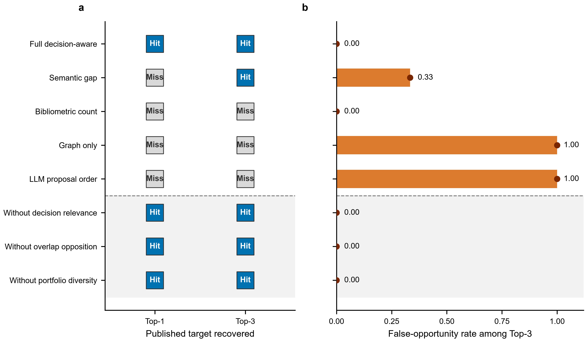

# Direct topic-opportunity evaluation, 2026-08-22

## Current claim boundary

The Lancet held-out run is a **legacy shared-candidate ranking-and-gating
test**. One
generation pipeline produced the candidate set; every direct control and
ablation reranked or filtered that same set. The run therefore does not test
whether decision-aware control improves candidate generation or blinded topic
discovery. Its false-opportunity outcome is also gate-defined: a selected
candidate counts as false when it fails at least one frozen opportunity gate,
and those gates are part of the full policy. The observed difference is useful
descriptive evidence for the pre-fix integrated filter on this set, but it is
not an independent outcome or a component-necessity result. The run also
predates the current construct contract: the frozen corpus lacks complete
record-level domain, explicit study/source-family, and verified pre-cutoff
decision-anchor mappings. Recalculation therefore returns incomplete
operationalization rather than silently treating global domain labels, PMIDs,
or PICO completeness as valid signals.

The trajectory artifact described below is **distillation export governance**.
It verifies which development traces may enter an export; no student was trained
from this contaminated topic artifact. A separate source-anchored protocol-stage
[development bootstrap](protocol-agent-distillation-bootstrap-results-2026-08-22.md)
has since been trained, but no student has been compared with a base model or
teacher on an unseen review family.

## Case and frozen boundary

> Validity correction: the database query excluded the target, but the frozen
> concept vocabulary was manually authored with target knowledge and included
> `exercise`. The run is therefore a broad-query architecture diagnostic, not a
> valid blinded topic-rediscovery experiment. The locked plan field
> `target_identity_used_for_landscape_or_proposals=false` is scientifically
> incorrect at the concept-layer boundary and is retained as an audit failure.

The development case was the BMJ network meta-analysis *Effect of exercise for
depression: systematic review and network meta-analysis of randomised
controlled trials* (DOI `10.1136/bmj-2023-075847`). It is a large review in a
common disabling condition: 218 randomised trials and 14,170 participants. The
identity, methods, and cutoff were verified from the [BMJ article](https://www.bmj.com/content/384/bmj-2023-075847.full),
the [open PMC record](https://pmc.ncbi.nlm.nih.gov/articles/PMC10870815/), and
the [OSF project](https://osf.io/nzw6u/). It is a registered development family,
not an independent held-out case.

The target-excluding PubMed query covered depression RCTs, systematic reviews, and
meta-analyses from 2021-01-01 through 2023-06-03 and did not contain exercise,
the target title, or DOI. Native NCBI retrieval returned 8,381 records. Temporal
and identity sanitization retained 8,014, excluded 184 post-cutoff and 183
date-unverifiable records, and excluded zero forbidden-identity records. The
frozen landscape contained 8,014 publication nodes, 13 concept nodes, and 8,007
edges; raw abstracts were not exported into the proposal landscape.

Frozen server artifacts are under
`/root/autodl-tmp/metawingman-direct-runs/topic-opportunity/bmj-exercise-depression-v1`.
The landscape SHA-256 is
`2ae11d77b51170ec67f39b52da170792e94fea288cfbff51ec12f7e34c6e241b`.
The proposal plan SHA-256 is
`352d185be00db3aac867f2029f61482be3a7ab49fafd65272e49f41aa697c049`.

## Locked execution

Three concept-stratified subgraphs used seeds 20260820, 20260821, and 20260822,
with at most 240 publications per subgraph. Prompt sizes were 185,901, 186,815,
and 193,159 characters, below the frozen 250,000-character limit. Preparation
made zero provider calls. Text generation used `deepseek-v4-flash`; the target
reference was not supplied to the proposer. The proposal lock was written
before independent external searches and before reference scoring.

Two seeds abstained after schema-repair failures. One repair was truncated at
4,096 completion tokens; the other retained an unknown node reference. The
third seed produced two valid proposals. Across all seeds, proposal generation
used 6 calls, 347,100 prompt tokens, 15,971 completion tokens, and 52.589
seconds. Cost was null/`unknown`.

Both valid proposals completed real PubMed RCT, review, and protocol searches,
deterministic signal calculation, leakage checks, and candidate promotion.
Audit provider calls were zero and there were no technical audit failures. One
candidate failed the frozen gates for active protocol overlap, existing-review
overlap, and known-item recall; the other passed all frozen hard gates.

## Direct baselines and ablations

Neither audited proposal reached the frozen weighted framework-similarity
threshold of 0.5. Similarities were 0.3875 and 0.0775, so every arm had target
hit@1 and target hit@3 equal to zero in all three repeats.

On the only non-empty repeat, bibliometric-count, semantic-gap, graph-only, and
LLM-order controls selected both candidates and had false-opportunity rate 0.5.
Full decision-aware control selected one candidate and had false-opportunity
rate 0.0. Removing decision relevance, overlap opposition, or portfolio
diversity produced the same selected singleton in this two-candidate set, so
this run does not identify which of those scoring components is independently
necessary. Across three repeats, the corresponding mean false-opportunity
rates were 1/6 for the four direct controls and 0 for the full and ablated gated
arms; mean selected counts were 2/3 and 1/3 respectively.

This is a negative, concept-contaminated architecture result. It supports a
bounded filtering effect on one non-empty candidate set, not blinded discovery
or discovery superiority. Two of three
proposal batches abstained, no arm recovered the published framework, model
memory contamination cannot be excluded, and the case was development rather
than held-out.

## Trajectory export governance

The pre-reference proposal and audit trajectory was initially converted into
four export examples: two proposal-stage abstentions, one frozen-hard-gate
failure, and one frozen-hard-gate success. Published target similarity was not
used as a training label. The schema-validated governance export retained one
review family, two abstentions, and one failure; its SHA-256 is
`24153994796988d80b06f68db3255fc13a04eb3ce157d9d5088f7cd09c91079d`.
The export reports no published-reference fields and required zero additional
provider calls. The later concept-layer contamination audit supersedes its
eligibility: the frozen file remains an audit artifact, and the registry blocks
this topic-proposal stage from student training. Clean, separately verified
development stages may enter future exports under their own gates. The export
contract assigns each example one of four dispositions: positive
demonstration, scientific negative decision, justified abstention, or
audit-only quarantine. These controls govern training data; they do not show
that distillation improves performance.

## Authoritative obesity development diagnostic

After freezing partial-valid-sibling retention and compact repair, the same
architecture was run on the pre-registered Nature Medicine adult
obesity pharmacotherapy family (DOI `10.1038/s41591-025-03978-z`; PMID
`41039116`). The [Nature Medicine record](https://www.nature.com/articles/s41591-025-03978-z)
and [PubMed record](https://pubmed.ncbi.nlm.nih.gov/41039116/) report a network
meta-analysis of 56 randomized trials and 60,307 adults, searched through 31
January 2025.

The PubMed query returned 6,677 records from 2022-01-01 through 2025-01-31.
Sanitization retained 6,417, excluded 208 post-cutoff and 52 date-unverifiable
records, and excluded zero forbidden-identity records. The landscape contained
6,417 publication nodes, 12 concept nodes, and 8,622 edges. Its SHA-256 is
`ee11ea6308a289a9a04fb97f4aa3ea0ceac9fc4f100dcad832a905197d7d63ee`;
the frozen proposal plan SHA-256 is
`ca9c5053d301ae8064b6cfc07672c7b4d3c1647377ab9bf96918fb87380244a1`.

The revised proposer preserved two valid sibling proposals in one call for the
first seed; two other seeds abstained after repair. Total proposal use was five
calls, 233,093 prompt tokens, 17,885 completion tokens, and 106.358 seconds;
cost remained null/`unknown`. Both candidates completed independent external
search and deterministic audit with zero audit provider calls.

No candidate met the frozen 0.5 lexical framework threshold; scores were
0.26368698 and 0.22970238. Both candidates failed frozen overlap gates. On the
only non-empty repeat, four direct controls selected both and had
false-opportunity rate 1.0, while the full decision-aware arm selected none and
had false-opportunity rate 0. Removing overlap opposition incorrectly admitted
one false opportunity. Thus the run supplies a development hard-gate stress test,
not topic recovery.

This run also fails the blinded-landscape requirement: its manually
authored concept vocabulary contained the target drug classes. In addition,
the lexical evaluator assigned intervention similarity zero to a proposal that
named GLP-1 and dual-incretin drug classes because the sealed reference used the
hypernym “obesity management medications.” These post-lock findings motivate
target-independent corpus-derived concepts and a separately frozen
hierarchy-aware evaluator. They do not alter the locked negative score, and the
trajectory is not admitted to distillation. Because the concept-layer target
conditioning was discovered after execution, the registry now marks this
family `development`/`diagnostic_only`, not held-out.

## Failure mechanism and frozen v2 change

The first validity failure was target-informed manual concept construction even
though the broad database query excluded the target. v3 therefore derives
concepts deterministically from document-frequency-ranked corpus n-grams and
records `concept_source`; manually authored target vocabularies cannot support
a blinded rediscovery claim.

The second failure was generation reliability: a single large prompt asked
for as many as eight high-dimensional proposals and failed closed if any
proposal was invalid. The v2 proposer therefore keeps independently valid
sibling proposals, records and drops invalid siblings, and uses a compact
repair prompt containing the invalid output plus an allowed-node whitelist
instead of resending the complete landscape. This change is covered by tests
for partial salvage, unknown-node rejection, compact repair, and leakage
boundaries. It was implemented after the BMJ reference was opened and therefore
must not be rerun on this case as confirmatory evidence. Its scientific value
requires a newly frozen authoritative case from an independent review family.

## Corpus-derived JAMA Pediatrics development calibration

The next development family was the JAMA Pediatrics review of portable
screen-based media and child sleep (DOI `10.1001/jamapediatrics.2016.2341`;
PMID `27802500`). The [PubMed record](https://pubmed.ncbi.nlm.nih.gov/27802500/)
reports a 12-database search through 15 June 2015, 20 studies, and 125,198
participants. The broad PubMed query omitted screen, device, media, the target
title, and the DOI. It returned 3,090 records; sanitization retained 2,954,
excluded 31 post-cutoff and 105 date-unverifiable records, and excluded zero
forbidden-identity records.

Global document-frequency concepts failed because generic abstract language
and obstructive sleep-apnoea terms dominated. A target-independent
decision-opportunity n-gram revision improved the vocabulary but still missed
the long-tail exposure. These failed landscapes remain frozen as development
diagnostics. The successful generation change was deterministic exhaustive
partitioning: every one of the 2,954 historical publications appeared in
exactly one of 25 bounded shards, with zero overlap and no target-conditioned
prompt. The run made 33 provider calls, used 1,640,715 prompt tokens and 53,556
completion tokens, and generated 51 proposals. Cost and wall time were not
recorded and remain null/`unknown`.

The original frozen RCT-only audit promoted 27 candidates and failed closed on
24, for a mapping ceiling of 0.52941176. It did generate a screen-use candidate
covering children and adolescents, sleep duration and quality, observational
studies, and random-effects meta-analysis. The original lexical score was only
0.36714286 and its known-item recall failed the frozen 0.8 floor, so no original
candidate was a target hit. Direct ranking controls selected three false
opportunities (false-opportunity rate 1.0); the full decision-aware arm selected
none (rate 0.0).

Post-lock diagnostics identified two method errors rather than changing that
score. The primary-study audit was hard-coded to RCTs despite the proposal
declaring cohort and cross-sectional designs. After study-design adaptation
and anchor-derived synonym expansion, the search hit the 500-result cap. A
bounded 5,000-result counterfactual mapped 23 primary studies, achieved
known-item recall 1.0, and passed every frozen decision gate with zero provider
calls. A separately recorded alias-calibration counterfactual scored the same
locked candidate 0.89 and crossed the 0.5 target threshold. Both are
development-only evidence: they freeze the next audit and evaluator contract
but do not convert JAMA into held-out confirmation.

## Lancet antidepressant held-out evaluation

The [Lancet antidepressant network meta-analysis](https://pmc.ncbi.nlm.nih.gov/articles/PMC5889788/)
(DOI `10.1016/S0140-6736(17)32802-7`; PMID `29477251`) was frozen as an
authoritative, representative held-out family before any provider call. It
reports an exact 8 January 2016 cutoff, 522 double-blind randomized trials,
116,477 adults, and comparative efficacy and acceptability for 21
antidepressants. The historical query omitted the target title, authors, DOI,
PMID, descendants, and post-cutoff evidence.

The source pool retained 4,174 pre-cutoff publications. Deterministic exhaustive
partitioning covered every publication exactly once across 35 shards. The
locked generation run made 37 provider calls, used 1,684,498 prompt tokens and
53,265 completion tokens, and produced 89 proposals. Independent search and
deterministic audit produced 83 candidates and quarantined six pipeline
failures, for a mapping ceiling of 0.93258427. Audit provider calls were zero;
proposal wall time was not recorded and cost remained null/`unknown`.

All reported controls and ablations received these same 83 audited candidates.
They differ only in ranking or gate application; no arm generated an
independent candidate set.

Only after the proposal and audit locks were complete was the published
reference opened. Two candidates crossed the frozen framework threshold. The
full decision-aware arm ranked a target candidate first and retained a target
within Top-3, with false-opportunity rate 0. Bibliometric count, graph-only, and
raw LLM order all missed the target at Top-3; graph-only and raw LLM order each
selected three false opportunities. Semantic-gap ranking recovered a target at
Top-3 but not Top-1 and selected one false opportunity.

Here, false-opportunity rate is the fraction of selected candidates that failed
at least one frozen opportunity gate. Because those same gates form part of the
full policy, this outcome is useful for auditing gate behavior but is not an
independent external label.

**Figure 2. Locked Lancet shared-candidate controls.** Panel a shows binary
recovery of the sealed published framework at Top-1 and Top-3 after reranking
one common candidate set. Panel b shows the proportion of each arm's three
selected candidates that failed at least one frozen opportunity gate. The
shaded rows are component ablations. Values are descriptive results from one
held-out review family; no sampling interval or significance test is implied.

This is a legacy pre-construct-fix shared-candidate ranking-and-gating result on
one authoritative held-out family. Under the current contract it is not a
confirmatory positive for the controller. It does not test candidate generation
or establish blinded discovery superiority. Removing decision relevance,
overlap opposition, or portfolio diversity left the same Top-3, so
component-specific necessity also remains unresolved. The held-out family
remains excluded from distillation and all method tuning.

## Final verification

At the recorded source snapshot, the local tree passed 495/495 Python tests in
75.874 seconds and all 61/61 executable R adapter manifests. The adversarial
boundary suite passed 5/5, and the distributable Skill bundle suite passed 9/9
after removal of an author-specific plotting path found by the first final
verification run. `git diff --check` passed. These counts describe that frozen
snapshot, not later live-worktree additions. The final secret-free source snapshot
`2373451ae16646ad` contained 1,592 verified files and passed focused validation
on the correct server; its validation-output SHA-256 was
`c93057de2adc26482555a60bc599c8226fa77de84c3f1e29f607a54a3e0ff58c`.
