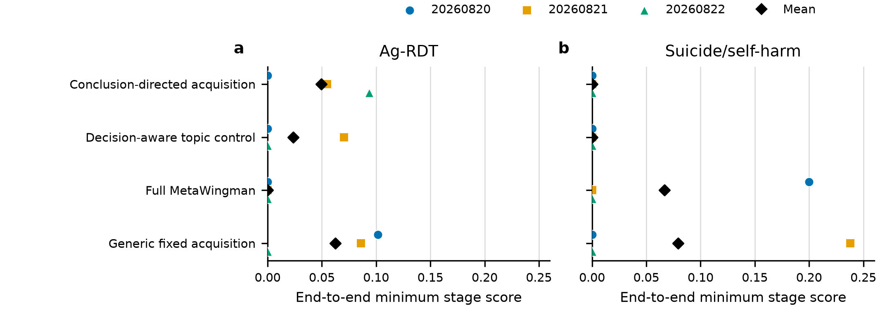

# Two-case metadata/abstract three-stage reconstruction (2026-08-22)

## Current interpretation and validity corrections

The legacy plan and metric names contain `end-to-end` and `E2E`. Those names
describe frozen historical artifacts, not the scientific scope of the runner.
The runner executed three bounded stages: protocol generation, screening with
free-text extraction from title/abstract records, and free-text synthesis. It
did not execute full-text retrieval, report-study-result lineage, risk of bias,
missing-evidence assessment, deterministic meta-analysis, GRADE, reporting, or
living-update equivalence. This report therefore calls the run a
**metadata/abstract three-stage reconstruction**.

Two post-lock validity findings further limit interpretation:

- **Ag-RDT is a version-mixed invalid diagnostic.** The sealed included-study
  workbook and 2021-08-31 cutoff belong to the 2022 update, but the scored
  reference metadata and conclusion axes named the 2021 article. The original
  rows and scores remain below for audit; they carry no scientific comparative
  interpretation until one article version, cutoff, workbook, and conclusion
  set are rebound and rescored.
- **Suicide/self-harm is a development proxy result.** The evaluated factor was
  conclusion-axis prompting and reranking, not the registered residual-risk x
  downstream-impact action controller. Checkpoint-to-record and review-family
  closure remain unresolved, so the case is not held-out evidence. Its frozen
  comparison is retained as a negative result for this proxy only.

## Decision

This frozen comparison did **not** show an independent performance advantage
for the evaluated conclusion-axis prompt/reranking proxy. That result is
retained unchanged; no post-result parameter selection or favourable rerun was
used. It neither tests nor falsifies the full conclusion-directed controller.
A post-lock implementation audit also found that the nominal
`topic_opportunity_control` factor only changed protocol prompt wording while
the runner still supplied a fixed target question. It did not construct a
time-bounded evidence landscape, propose candidate topics, independently audit
signals, or apply opportunity gates. The topic-labelled arm is therefore an
architecture diagnostic, not a valid direct test or negative scientific result
for decision-aware topic opportunity control.

The experiment supports narrower engineering claims: the historical corpus,
operational sealed-reference boundary, exact slot grid, immutable locks,
zero-retry provider execution, post-lock scoring, and an unknown/post-cutoff
membership-and-date counterfactual all ran under their registered contracts.
Model/checkpoint family isolation remains unresolved. These controls do not
establish complete-review accuracy, human replacement, clinical validity, a
held-out result, or an independent verifier effect.

## Frozen design and provenance

| Item | Frozen value |
|---|---|
| Cases | Ag-RDT diagnostic living review; COVID-19 self-harm/suicide living review |
| Current scientific status | Ag-RDT version-mixed invalid diagnostic; suicide/self-harm development proxy with unresolved checkpoint-family closure |
| Factorial grid | 2 cases x 4 configurations x 3 seeds = 24 slots |
| Seeds | 20260820, 20260821, 20260822 |
| Text model | `deepseek-v4-flash` |
| Source build | `679c2786b24429b1` |
| Legacy plan ID | `two-case-end-to-end-direct-evidence-v3` |
| Plan SHA-256 | `7e4be1da42ca85b4671836900c97b25f8d6b22e31a42df4bddfc8095f835bea2` |
| Output lock SHA-256 | `70521bceda94447c1dcce3cb4574d5659128369de5902eee466ebeee0fac581a` |
| Reference access | after all 24 receipts and the complete output lock only |
| Per-slot ceiling | 6 calls, 32,000 input tokens, 12,288 output tokens, zero retries, 900 seconds |

The source snapshot passed the full server validation before execution and was
freshly revalidated after scoring. The final validation output SHA-256 values
were `922b7c4f2cc1a3a563fd0b4c42f0973888805f9710800ff98c66067ae5649d32`
for Python and
`1b3d21d7ee20ae07cf8ca02636b9df2de177ba0a17cef48d08920bdb18ec48ec`
for the R adapter suite. At that recorded source snapshot, the local tree passed
a 441-test Python run in 72.313 seconds. The plotting entry point and its 24-row
input were also executed directly and audited. These receipts describe the
frozen historical snapshot, not the later live worktree.

## Historical corpus and mapping ceilings

The suicide/self-harm corpus was rebuilt to the June 7, 2020 cutoff. PubMed
returned 1,436 raw records and the operational corpus retained 697 after
excluding one forbidden-identity record, 677 post-cutoff records, and 61
unverifiable records. Its corpus SHA-256 is
`15f10aac066f17ba73f8ac4c3c8d108941cce882fb308a7e11dd3d1d28bbd776`.
Coverage is PubMed-only, so it is not a complete reconstruction of the original
multi-source search.

Reference-to-operational mapping imposed a ceiling before model evaluation:

| Case | Reference rows | Unique mapped records | Mapping ceiling | Mapping methods |
|---|---:|---:|---:|---|
| Ag-RDT | 207 | 128 | 61.8% | 1 DOI and 127 exact-title matches |
| Suicide/self-harm | 30 | 21 | 70.0% | 16 DOI and 5 exact-title matches |

For the suicide/self-harm case, the sealed June 7 target is the first report
(version 1); the October 2020 version 2 DOI was treated as later publication
history, not as a source of June 7 answers. The public records describing these
versions are the [June 7 first report](https://research-information.bris.ac.uk/en/publications/the-impact-of-the-covid-19-pandemic-on-self-harm-and-suicidal-beh-3/)
and [version 2 article record](https://pmc.ncbi.nlm.nih.gov/articles/PMC7871358/).
The Ag-RDT bundle named the
[2021 PLOS Medicine article](https://journals.plos.org/plosmedicine/article?id=10.1371%2Fjournal.pmed.1003735)
but mapped included studies from the 2022-update workbook at the 2021-08-31
cutoff. This version mismatch invalidates scientific interpretation of its
scores.

## Conclusion-axis acquisition proxy and membership/date replay

The suicide acquisition primary namespace completed and locked 12/12 slots
with SHA-256
`57a222792296a7f3fba2a971f1608b35249d72d6908b8d2a20b415ae68cddf60`.
An independent compact receipt audit recomputed all 12 output hashes and
confirmed their plan, case, seed, configuration, and corpus bindings. It found
24 provider calls and 24 provider-audit records; 11 slots selected at least one
candidate and one slot recorded the valid terminal state
`abstained_no_supported_candidate`. A fresh validate-only pass returned
`provider_calls = 0`, while the immutable lock remained `locked` with 12 slots.
All configurations reached Recall@1000 = 1.0 within
the 21-record mapped reference ceiling, but selection-level results were highly
seed-sensitive, including a legitimate empty selection in one
conclusion-directed seed. The paired r2 replay made zero new provider calls;
its copied token fields are inherited metadata and are not new consumption.

Primary selection metrics, averaged over the three frozen seeds, were:

| Configuration | Recall@50 | Recall@200 | Selected recall | Selected precision |
|---|---:|---:|---:|---:|
| Generic fixed, unverified | 0.397 | 0.667 | 0.286 | 0.207 |
| Generic fixed, membership/date verified | 0.381 | 0.635 | 0.286 | 0.347 |
| Conclusion-axis proxy, unverified | 0.524 | 0.635 | 0.317 | 0.281 |
| Conclusion-axis proxy plus membership/date gate | 0.476 | 0.651 | 0.238 | 0.390 |

These values do not show a consistent recall improvement for the full-labelled
proxy. The apparent precision increase after the membership/date gate is a
property of deterministic removal of invalid identifiers, not evidence that the
uninstantiated residual-risk x claim-impact controller improved evidence
acquisition.

The preregistered membership/date counterfactual plan SHA-256 was
`de0943e294fc78eb047e0d1094baa535a5619c77caeee908cd31f317e7693195`.
Across all six unverified configurations/seeds, injecting one unknown ID and one
June 8 post-cutoff PMID produced exactly one `unknown` and one `post_cutoff`
rejection while preserving every baseline verified set. The replay made zero
provider calls. This establishes deterministic corpus-membership and temporal
enforcement for these two injected error classes. It does not verify article
identity, report-study-result lineage, eligibility, extraction correctness,
claim entailment, or scientific independence of a same-provider role.

Primary acquisition resources were 24 calls, 45,656 input tokens, 5,435 output
tokens, and 54.800 seconds in aggregate. Provider cost was null and its status
was `unknown`; no monetary estimate is reported.

## Metadata/abstract three-stage r3 historical result

**Figure 1. Frozen-seed weakest-stage performance.** Points are the three
preregistered seeds; marker shape and colour redundantly encode seed. Black
diamonds are descriptive means. No inferential interval or significance test is
shown because there are only three seeds per configuration and two cases.

Values are means over three frozen seeds. The frozen table retains the legacy
metric label `E2E min`. It is the minimum of framework similarity, screening
recall, and conclusion-axis coverage within each slot, then averaged. It is a
three-stage weakest-component score, not an end-to-end review metric.

| Case | Configuration | Framework | Recall | Precision | Axis coverage | E2E min |
|---|---|---:|---:|---:|---:|---:|
| Ag-RDT | conclusion-directed acquisition | 0.407 | 0.076 | 0.319 | 0.733 | 0.049 |
| Ag-RDT | decision-aware topic control | 0.219 | 0.081 | 0.370 | 0.733 | 0.023 |
| Ag-RDT | full MetaWingman | 0.463 | 0.076 | 0.314 | 0.200 | 0.000 |
| Ag-RDT | generic fixed acquisition | **0.705** | **0.081** | **0.454** | 0.400 | **0.063** |
| Suicide/self-harm | conclusion-directed acquisition | 0.316 | **0.317** | 0.303 | **0.133** | 0.000 |
| Suicide/self-harm | decision-aware topic control | 0.259 | **0.317** | 0.271 | 0.000 | 0.000 |
| Suicide/self-harm | full MetaWingman | 0.114 | 0.270 | 0.291 | 0.067 | 0.067 |
| Suicide/self-harm | generic fixed acquisition | **0.327** | 0.270 | **0.350** | **0.133** | **0.079** |

The generic fixed-acquisition baseline had the highest mean legacy `E2E min`
score in both cases. The Ag-RDT comparison is scientifically invalid because of
the version-mixed gold. In the suicide/self-harm development case, the
conclusion-axis proxy tied or exceeded some individual stage means but did not
produce a consistent three-stage advantage; the full-labelled configuration
also did not outperform the baseline. Three seeds measure run variability, not
review-family generalization.

All 24 slots completed screening. Stage status combinations were:

- 9 invalid protocol / completed screening / completed synthesis;
- 2 normalized protocol / completed screening / invalid synthesis;
- 6 normalized protocol / completed screening / completed synthesis;
- 1 completed protocol / completed screening / invalid synthesis; and
- 6 completed protocol / completed screening / completed synthesis.

Thus 9/24 protocol outputs and 3/24 synthesis outputs were typed abstentions for
provider-schema invalidity. Deterministic normalization accepted only bounded
shape-equivalent outputs; it did not rewrite semantic content. The residual
schema failure is a material reliability limitation and contributes exact zero
stage scores.

Resource audit found 144 calls, 290,072 input tokens, 60,607 output tokens, and
465.047 seconds in aggregate. Every receipt used exactly six calls. Per-slot
maxima were 18,278 input tokens, 5,054 output tokens, and 31.372 seconds; zero
slots exceeded the frozen budget. Provider cost remained null/`unknown`.

## Preserved diagnostics

- r1 (72 calls) is retained as a prompt-contract diagnostic: all 24 protocol
  stages abstained because the required JSON example was ambiguous and the
  acquisition input exposed only the top 25 candidates.
- r2 (144 calls) corrected that prompt and used top-100 input in four batches,
  but only 7/24 protocol stages completed. Its plan also understated the actual
  six calls as a three-call ceiling, so r2 is not the main budget-matched result.
- r3 preregistered the six-call ceiling and added bounded deterministic shape
  normalization before execution. Its remaining failures and the
  conclusion-axis-proxy comparative result are retained unchanged. The
  topic-labelled contrast is retained as an architecture diagnostic because
  the intended topic mechanism was not instantiated.

## Topic-opportunity boundary

Matched deterministic baselines and ablations are implemented for bibliometric
count, semantic gap, graph-only, LLM proposal order, full decision-aware
control, and removal of overlap opposition, decision relevance, or portfolio
diversity. They were not promoted to a scientific topic-rediscovery result in
this run: both current corpora were built with target-conditioned queries, so
using them to claim blinded recovery of the target review question would be
circular. A separate broad, non-target-conditioned development evaluation was
subsequently executed and is reported in the
[direct topic-opportunity report](topic-opportunity-direct-results-2026-08-22.md);
it was a negative rediscovery result.

## Supported and unsupported claims

Supported here:

- two lawfully handled historical source bundles executed under one exact,
  locked grid;
- the operational published references stayed sealed until the 24-slot output
  lock; checkpoint-family isolation was not established;
- the corpus-membership/date gate rejected the registered unknown and
  post-cutoff injections;
- the frozen resource limits were respected;
- the suicide/self-harm development comparison found no independent advantage
  for its conclusion-axis prompt/reranking proxy under the frozen fixed-question
  contract;
- the Ag-RDT numbers remain an invalid version-mixing diagnostic; and
- the nominal topic-labelled prompt arm did not outperform the baseline, but
  the intended decision-aware topic-opportunity mechanism was not instantiated.

Not established here:

- end-to-end review reconstruction, complete multi-database retrieval, or
  full-text reconstruction;
- false-exclusion safety or quantitative meta-analysis accuracy;
- topic-opportunity target rediscovery or cross-family generalization;
- the full residual-risk x downstream-impact acquisition controller;
- held-out status, provider/model-memory independence, or checkpoint-family
  closure;
- superiority over expert review, lower workload, or clinical benefit; or
- generalization beyond these two cases.
