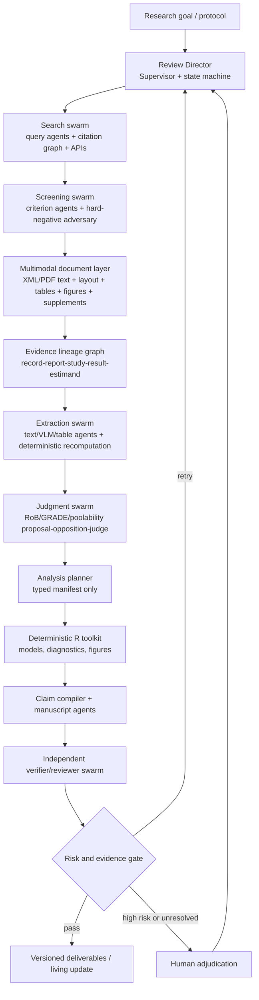

# MetaWingman 的 AI 原生多模态 Agent 架构

检索与核验日期：2026-08-13
研究问题：如何把顶刊与顶会中的 AI Scientist、多智能体、检索增强、文档多模态理解、不确定性控制和工具验证方法，迁移为系统综述与 Meta-analysis 的端到端 AI 系统？

## 执行结论

MetaWingman 应从“方法学 skill 加一组脚本”升级为 **AI-first、evidence-grounded、human-overseen 的系统综述操作系统**：模型默认承担从选题到 living update 的全部可执行工作，人不再逐条完成主流程，而是在高风险、模型分歧、证据缺失和最终责任节点介入。

对外贡献不应平铺成“更多 agents、更多工具”。顶刊式主线压缩为四项：**decision-aware topic opportunity control** 把截止日前的多领域证据图转成可操作选题组合，**全生命周期 evidence-synthesis scientist** 是系统贡献，**结论风险导向的证据获取与验证** 是方法贡献，**时间封存的选题重发现与单协议扰动回放** 是评价贡献。多模型编队、多模态解析、proposal-opposition-judge、外部 verifier、evidence graph 和 living state 是支撑机制，不单独冒充创新。

这与“无条件全自动”不同。当前最有说服力的研究表述是：

> 在预先规定的安全阈值下，最大化端到端 AI 覆盖率，控制关键错误、成本与延迟，并让每个决定、数值和结论都能回放到原始证据与确定性工具输出。

系统不应只调用一个最强模型。已核验的可迁移机制更精确地说是：AI Scientist 展示了从想法、实验、代码、论文到评审的阶段化自动化与 agentic search，但其论文不能支持“系统综述可无人化”的外推；Co-Scientist 通过 Supervisor 调度 Generation、Reflection、Ranking、Evolution、Proximity 和 Meta-review，并把 test-time compute 用在候选假设竞赛上；Virtual Lab 使用 PI agent、领域 scientist agents、专用科学模型与人类高层反馈。MetaWingman 最适合继承的是 **capability-based 多模型编队 + 状态机 + 外部工具 + 验证闭环**，不是角色扮演式群聊。

## 一、可直接迁移的顶刊与顶会方法

| 来源 | 已验证的核心机制 | 迁移到 MetaWingman | 不能照搬的部分 |
|---|---|---|---|
| [The AI Scientist, Nature 2026](https://www.nature.com/articles/s41586-026-10265-5) | 端到端研究生命周期、idea generation、coding、experiments、manuscript generation、automated review、template-free agentic search | 对检索式、纳排式、抽取式和分析 manifest 生成多个候选轨迹，以可执行 verifier 选择下一 checkpoint；把“能自动做完一轮”与“通过外部质量门”分开评估 | 其主要实验是可在计算机内闭环的机器学习研究；自动 reviewer 与被评系统存在循环评价风险，不能代替 Meta 的证据真值；不能据此声称系统综述无需人工 |
| [Co-Scientist, Nature 2026](https://www.nature.com/articles/s41586-026-10644-y) | Supervisor、生成—反思—排名—演化—元审查、tournament、test-time compute scaling、专家反馈 | 对检索式、纳排解释、RoB dossier、poolability 和结论生成多候选；以外部证据、规则和执行结果排名；难题增加推理预算 | Elo 或模型自评不是科学正确性的独立真值；排名必须接入金标准、原文证据和确定性检查 |
| [Virtual Lab, Nature 2025](https://www.nature.com/articles/s41586-025-09442-9) | PI agent 调度跨学科 scientist agents，结合 ESM、AlphaFold-Multimer、Rosetta，并由人类给高层反馈和实验验证 | 由 Review Director 调度检索方法学、临床、统计、视觉文档、偏倚评价和写作 agents；统计工具与文献 API 是正式团队成员；人主要设定目标与处理升级 | 不能把多个同源 LLM persona 当作真正独立专家；必须采用异构模型、不同证据视图和确定性工具形成差异化 |
| [Coscientist, Nature 2023](https://www.nature.com/articles/s41586-023-06792-0) | LLM 规划、互联网与文档检索、代码执行、专用工具和实验自动化结合 | 将 reasoning 与数据库 API、浏览器 handoff、PDF parser、R toolkit、验证脚本交错执行；每个动作产生 observation 和状态变更 | 账户登录、验证码、许可数据库和下载授权不能交给无边界自动化；凭证必须与模型上下文隔离 |
| [OpenScholar, Nature 2026](https://www.nature.com/articles/s41586-025-10072-4) | 专门文献语料、检索增强、多论文综合、逐项引用和专家 benchmark | 建立“检索—证据片段—综合—引用核验”链；把通用模型生成与领域检索器分开；用专家问题集评估而非只看文本流畅度 | 文献问答正确不等于系统综述召回充分；不能以回答质量替代数据库级可复现搜索和 study lineage |
| [Cochrane Handbook Chapter 2](https://training.cochrane.org/handbook/current/chapter-02) 与 [Towards evidence based research, BMJ 2016](https://www.bmj.com/content/355/bmj.i5440) | 问题范围、决策相关性、既有证据与利益相关者优先级是选题的正式方法学基础 | 把“是否值得做、是否重复、是否能改变决策”编译为显式信号和门，而不是让模型按新颖措辞排序 | 权威方法学不提供一个通用机器机会分，也不保证已发表选题最优；价值权重和最终选题仍需责任主体确认 |
| [SciMON, ACL 2024](https://aclanthology.org/2024.acl-long.18/) 与 [ResearchAgent, NAACL 2025](https://aclanthology.org/2025.naacl-long.342/) | 文献启发检索、学术图谱/知识库、迭代提案与多 reviewer critique | 从截止日前文献图产生候选，再由 overlap opposition 和独立 verifier 查重、查可行性和查反证 | 自然语言 idea quality 不是 operational review question；相关模型 reviewer 也不是独立科学真值 |
| [大规模 LLM ideation 研究, ICLR 2025](https://proceedings.iclr.cc/paper_files/paper/2025/hash/ea94957d81b1c1caf87ef5319fa6b467-Abstract-Conference.html) | 100 余名 NLP 研究者参与的盲法比较显示，LLM 提案被评为更有新颖性但可行性略低，并暴露自评与多样性问题 | 选题 benchmark 分开评估 novelty、feasibility、diversity 与稳定性；禁止用模型自评支持方法有效 | 该研究只针对 NLP 研究想法；不能外推为系统综述选题优于人，MetaWingman 也没有人工执行对照臂 |
| [Marwitz et al., Nature Machine Intelligence 2026](https://www.nature.com/articles/s42256-026-01206-y) 与 [DELPHI, Nature Biotechnology 2021](https://www.nature.com/articles/s41587-021-00907-6) | LLM 概念抽取、时间演化图、语义/拓扑 link prediction、盲法回测和多样化候选组合 | 建立 time-sliced evidence graph，从未连接概念、时间缺口与跨域桥接提出候选，保留规则/语义/学习模型对照 | 未来概念连接或高 citation impact 不等于综述价值、非重复性、公平性、可行性或决策影响；Marwitz 只有十名专家的定性访谈 |
| [PaperQA2](https://arxiv.org/abs/2409.13740) | 对检索、综合、矛盾发现进行真实人机比较；RAG agent 迭代搜索和证据排序 | 用于“追问式检索”、伴随报告发现、矛盾研究定位和 claim-level citation；保留其人类无工具限制的比较思路 | 仍是预印本；问答/综述性写作 benchmark 不能直接证明纳排、数值抽取和 RoB 正确 |
| [SciRAG, EACL 2026](https://aclanthology.org/2026.eacl-long.303/) | 顺序/并行自适应检索、正反向 citation graph、outline-guided plan–critic–solve、backtrack editing | 搜索既做主题广度扩展，也沿注册号、参考文献和被引链做深度追踪；按协议问题树组织综合；发现证据缺口后回溯检索 | citation graph 有覆盖偏差，不能代替 Embase、CENTRAL、监管与灰色文献等预设来源 |
| [ReAct, ICLR 2023](https://openreview.net/forum?id=WE_vluYUL-X) 与 [Toolformer, NeurIPS 2023](https://proceedings.neurips.cc/paper/2023/hash/d842425e4bf79ba039352da0f658a906-Abstract-Conference.html) | 推理与动作交错；模型学习何时调用何种 API | Review Director 只能通过 typed tools 搜索、下载、解析、计算和验证；每次动作后的 observation 写入事件账本，再决定下一步 | 自由文本工具调用容易越权和产生不可复现参数；生产实现必须使用 schema、权限和幂等键 |
| [Tree of Thoughts, NeurIPS 2023](https://proceedings.neurips.cc/paper/2023/hash/271db9922b8d1f4dd7aaef84ed5ac703-Abstract.html) 与 [Buffer of Thoughts, NeurIPS 2024](https://proceedings.neurips.cc/paper_files/paper/2024/hash/cde328b7bf6358f5ebb91fe9c539745e-Abstract-Conference.html) | 探索多个推理分支、回溯；复用高层 reasoning templates 降低成本 | 对模糊 protocol、复杂多臂/多时间点 lineage、RoB 和 estimand alignment 保留多个假设图；将通过验证的解决模板沉淀为可版本化方法模板 | 不能让模型自评分支成为唯一剪枝依据；候选必须通过证据覆盖、规则、算术和专家标签评价 |
| [Self-RAG, ICLR 2024](https://openreview.net/forum?id=hSyW5go0v8) 与 [CRITIC, ICLR 2024](https://openreview.net/forum?id=Sx038qxjek) | 按需检索、对相关性/支持度/效用反思；用外部工具 verify-then-correct | 每个结论片段判断是否需要追加检索；citation verifier、DOI/PMID resolver、计算器和 R runner 对生成结果做外部批评后再修正 | 同一模型的无工具自我反思不能当验证；ICLR 2024 的研究也表明 intrinsic self-correction 不可靠 |
| [Multiagent Debate, ICML 2024](https://proceedings.mlr.press/v235/du24e.html) 与 [Mixture-of-Agents, ICLR 2025](https://proceedings.iclr.cc/paper_files/paper/2025/hash/5434be94e82c54327bb9dcaf7fca52b6-Abstract-Conference.html) | 多实例提出、交换和聚合答案；MoA 使用分层多模型聚合，在通用生成 benchmark 上提升质量 | 纳排 hard negative、RoB、GRADE 和可合并性采用 proposal–opposition–judge；至少一个 agent 专门寻找排除证据或替代解释；聚合器必须读取证据锚点而非只读回答文本 | 同模型多采样的错误高度相关；MoA 主要验证通用生成质量，不是证据综合真值；最终 judge 必须看到原文证据和规则，并与候选生成模型隔离 |
| [Nougat, ICLR 2024](https://proceedings.iclr.cc/paper_files/paper/2024/hash/a39a9aceda771cded859ae7560530e09-Abstract-Conference.html) 与 [OmniDocBench, CVPR 2025](https://openaccess.thecvf.com/content/CVPR2025/html/Ouyang_OmniDocBench_Benchmarking_Diverse_PDF_Document_Parsing_with_Comprehensive_Annotations_CVPR_2025_paper.html) | 科学 PDF 到结构化标记；对文字、公式、表格、布局和文档属性做多层评测 | 构建 PDF document object model，同时保留页面图像、版面块、文本、表格网格、图和坐标；解析器 ensemble 在页/块/单元格层比较 | 单一 OCR 或 VLM 不能可靠覆盖补充表、跨页表、扫描件和复杂图；必须保留原页与坐标并做字段级验证 |
| [Semantic entropy, Nature 2024](https://www.nature.com/articles/s41586-024-07421-0) | 在语义而非字面层估计多次生成分歧，可识别部分 confabulation 并支持拒答 | criterion、字段和 judgment 分别采样，结合跨模型分歧、证据覆盖和规则冲突计算升级信号 | 只能发现部分随机性错误，无法发现模型“稳定地错”；不能把低熵解释成正确 |
| [Conformal tail risk control, ICML 2025](https://proceedings.mlr.press/v267/chen25bd.html) | 用轻量校准控制黑箱模型尾部风险与人机评分偏差 | 在有专家金标准的组件上校准自动接受阈值，优化 false exclusion、unsupported value 等高代价尾部风险 | 需要同分布或明确漂移监测；不能把统计保证外推到未覆盖的 review 类型和语言 |
| [ASReview, Nature Machine Intelligence 2021](https://www.nature.com/articles/s42256-020-00287-7)、[statistical stopping, 2020](https://doi.org/10.1186/s13643-020-01521-4) 与 [SAFE, 2024](https://doi.org/10.1186/s13643-024-02502-7) | Active learning 优先排序、透明记录，以及在明确假设下估计停止或用启发式检索潜在遗漏 | Study screening 以高召回和 false-exclusion loss 校准，比较固定阈值、统计停止、SAFE 和风险控制；停止仍写成候选决定 | Active learning 不证明初始语料完整；17% 是统计停止论文测试集的平均节省而非通用数值；SAFE 是实用启发式，不是分布无关保证 |
| [Conformal Risk Control, ICLR 2024](https://proceedings.iclr.cc/paper_files/paper/2024/hash/f3549ef9b5ff520a7e41ff3cc306ab2b-Abstract-Conference.html) | 对嵌套预测/决策规则按任务损失选择风险受控工作点 | 候选用于 topic set、screening set 或 abstention threshold 的 review-family 校准，并把不对称科学损失写入评估 | 尚未验证 exchangeability、nestedness、样本量和漂移条件前，不能称 false exclusion 获得 conformal guarantee，也不能授权生产停止 |
| [HybridLLM, ICLR 2024](https://proceedings.iclr.cc/paper_files/paper/2024/hash/b47d93c99fa22ac0b377578af0a1f63a-Abstract-Conference.html) 与 [RouteLLM, ICLR 2025](https://proceedings.iclr.cc/paper_files/paper/2025/hash/5503a7c69d48a2f86fc00b3dc09de686-Abstract-Conference.html) | 根据问题难度和预算在小/大模型间路由，优化质量—成本前沿；RouteLLM 用 preference data 训练 router | 简单去重、格式化、明确排除由轻量模型；视觉表格、模糊纳排、复杂偏倚和统计设计转强推理或 VLM；根据失败动态升级 | 路由器必须用 Meta 任务级真值训练，不能只凭 prompt 长度、通用偏好分或模型自报难度；任务分布漂移要触发重新校准 |
| [DSPy, ICLR 2024](https://proceedings.iclr.cc/paper_files/paper/2024/hash/f1cf02ce09757f57c3b93c0db83181e0-Abstract-Conference.html) 与 [test-time compute scaling, ICLR 2025](https://proceedings.iclr.cc/paper_files/paper/2025/hash/1b623663fd9b874366f3ce019fdfdd44-Abstract-Conference.html) | 将 LM pipeline 表达为可优化模块；按题目难度动态分配推理和 verifier 预算 | 版本化 criterion/extraction/judgment modules 与 demonstrations，用 review-family holdout 和不对称损失编译；按错误传播风险扩展候选、反对者和验证调用 | 优化器会放大错误指标或数据泄漏；数学推理 benchmark 的 compute scaling 不能证明 Meta 任务受益，更多调用也不能弥补证据缺失 |
| [Lost in the Middle, TACL 2024](https://aclanthology.org/2024.tacl-1.9/) | 长上下文模型对相关信息位置敏感，中部证据利用可显著下降 | 对长 PDF、补充材料和多报告集合做 position-shift probes、section-aware retrieval 与 anchor recall；不能只把全文塞入上下文 | 上下文窗口大小不等于证据已被读取；需按字段和位置评测 |
| [SWE-agent, NeurIPS 2024](https://proceedings.neurips.cc/paper_files/paper/2024/hash/5a7c947568c1b1328ccc5230172e1e7c-Abstract-Conference.html) 与 [tau-bench, ICLR 2025](https://proceedings.iclr.cc/paper_files/paper/2025/hash/1b126cc38b8638e07bef37e7b2bb72bf-Abstract-Conference.html) | 专为 agent 设计的接口会影响能力；以数据库终态和重复运行衡量政策遵循与可靠性 | 建立窄而 typed 的 scientific action/observation interface；评测协议遵循、最终科学状态和 repeated-run pass，而不是只读轨迹 | 软件修复和客服领域不是证据综合；必须另建 protocol、lineage、授权访问和科学状态任务 |
| [LLM-as-a-Judge, NeurIPS 2023](https://proceedings.neurips.cc/paper_files/paper/2023/hash/91f18a1287b398d378ef22505bf41832-Abstract-Datasets_and_Benchmarks.html) | 自动 judge 存在位置、冗长、自我偏好和推理偏差 | 候选次序随机与 swap、generator/judge 隔离、证据和 rubric 显式输入、用专家 discordant set 校准 | 人类偏好一致性不等于科学正确；judge 不能高于原文、规则和可执行 verifier |
| [POPPER, ICML 2025](https://proceedings.mlr.press/v267/huang25n.html) 与 [Robin, Nature 2026](https://www.nature.com/articles/s41586-026-10652-y) | 把高层假设拆为可证伪测试并顺序控制；将文献检索、数据分析、实验反馈和假设修订保持在连续状态 | 对可检验的分析/一致性 claim 生成反证测试并执行；把 living review 的新证据作为图状态反馈，而非追加摘要 | 子测试未必由主 claim 蕴含；I 类错误控制不等于全局真值；Robin 的强证据依赖真实实验反馈，文献 agent 不能伪装这一层 |
| [Kosmos, arXiv 2025](https://arxiv.org/abs/2511.02824) | 用 structured world model 在最长 12 小时、并行文献检索与数据分析的长程循环中共享状态 | evidence graph 同时保存协议、文献 claim、分析 observation、未决问题和下一动作，使所有阶段读取同一全局科学状态，而不是依赖局部聊天摘要 | 目前是预印本；作者报告的 statement accuracy、发现数和人类时间等效不能外推为系统综述召回、正确率或节时 |
| [Agentic X-ray Scientist, Nature Machine Intelligence 2026](https://www.nature.com/articles/s42256-026-01261-5) | MCP 结构化工具、plan-act-observe 闭环、虚拟六圆衍射仪中的失败修正，并迁移到真实同步辐射束线 | 先在 fixtures 和密封重建中发现越权、状态和方法失败，再晋升到真实 review 与前瞻性 update；工具 observation 必须改变下一步状态 | 验证的是窄范围样品对准，不是完整科研推理；长 prompt 中仍有规则未被遵守，支持 schema/guard 而不是纯提示词治理 |

## 二、建议的系统总架构



### 1. Control plane：Review Director

Review Director 不是写作模型，而是一个持久状态机。它读取 protocol、当前 gate、可用数据、未解决冲突、预算和失败记录；只分派明确输入/输出 schema 的任务。其策略借鉴 AI Scientist 的阶段 checkpoint 与 Co-Scientist 的 Supervisor：

1. 为当前科学节点生成若干候选 action；
2. 预估每个 action 的收益、风险、成本和可逆性；
3. 选择模型、推理预算、工具和验证器；
4. 执行后把 observation 写入 append-only event ledger；
5. 只有满足 gate 才更新全局状态，否则重试、换模型、回溯或升级给人。

### 2. Model plane：异构模型编队

模型不按品牌硬编码，而按可替换 capability slots 配置：

| Slot | 主要工作 | 默认策略 |
|---|---|---|
| `reasoning_frontier` | 协议编译、复杂纳排、lineage、RoB/GRADE、poolability、反证推理 | 少量高价值调用；树搜索、对抗和最终 judge |
| `vision_document` | 页面布局、表格、图、扫描件、补充材料、坐标锚定 | 与原生 XML/文本 parser 并行；不单独决定最终数值 |
| `high_throughput` | 查询扩展、题录初筛、字段候选、格式化、批量检查 | 高并发、低成本；低置信度自动升级 |
| `retrieval_embedding` | 题录、段落、表格、图注和引用链召回/重排 | 稀疏 + dense + citation graph 混合召回 |
| `entailment_verifier` | claim–evidence 支持/反驳、跨模型语义聚类 | 与生成模型隔离；处理原子 claim 和 criterion |
| `code_agent` | 生成受限 manifest、修复 adapters、测试代码 | 无权直接更改冻结数据或选择未注册分析 |
| `deterministic_tools` | DOI/PMID 核验、去重、算术、R 分析、hash、schema validation | 结果优先于 LLM 自述；失败即阻断下游 |

这套架构允许接入多个云端或本地模型，但必须记录 provider、model、版本、参数、prompt hash、token、成本、延迟和输出 hash。模型替换后先跑回归集，不能静默漂移。

### 3. Evidence plane：多模态文档对象与证据图

每篇报告建立统一 `Document Object Model`：

```text
document
  -> pages
    -> layout blocks
      -> paragraph / table / figure / caption / equation / footnote
        -> text spans or cells
          -> bounding boxes + parser + confidence + checksum
```

同一页至少保留三条证据通道：原始 PDF 页面、结构化文本/表格、视觉模型理解。抽取 agent 只能把值写成候选，并附 `report_id + page + block/cell + bbox + quote/image crop`。随后由确定性规则复算单位、分母、arm total、CI/SE 和跨表一致性。视觉与文本一致不是充分条件；二者可能来自同一 OCR 错误，因此原生 XML、PDF text layer、page image 和表格结构应尽量保持异源。

所有对象进入 decision provenance graph：

`protocol predicate -> record -> report -> study/trial -> arm -> result -> raw datum -> derived value -> appraisal -> synthesis -> claim`

这样，多模态模型不只是“看 PDF 回答问题”，而是在一个带约束的全局状态上逐步填充。后续可借鉴 progressive filling：先确认注册号、arms、样本量、主要结局等高置信锚点，再用这些锚点约束难字段，减少逐字段独立抽取造成的全局矛盾。

## 三、端到端 AI 工作流应该怎样运行

### 方法学权威与运行模式

通用 agent 论文只提供工程候选机制，不得改变系统综述的纳排、estimand、统计或 certainty 规则。每个项目先固定 review profile、conduct/reporting/appraisal 权威及版本，再选择运行模式：`assurance` 按权威指南保留强制独立人工决定，`evaluation` 用预注册金标准研究 AI 替代，`rapid` 公开所有加速捷径。完整约束见[端到端方法学蓝图](../docs/architecture/end-to-end-methodology-blueprint.md)和[原始来源注册表](../metawingman/references/methodology-source-registry.md)。

### Stage 0–1：选题、可行性与协议

- `Landscape Builder` 只纳入截止日前、带来源锚点的原始研究、注册、既有综述/protocol、指南、优先级陈述、结果与不确定性，构建 typed temporal evidence graph。
- `Question Proposer` 从图路径、缺口、更新信号、优先级和跨领域桥接生成多个结构化候选。模型只提出 framework、证据节点和反证检索，不给自己的候选打机会分。
- `Overlap Opposition` 主动搜索已有综述、protocol registry、临床指南、试验注册、撤稿与更正；`Feasibility Verifier` 独立核实研究量、来源覆盖、全文与可抽取性。
- 冻结的 `Value-Risk Judge` 分开记录决策价值、未解决不确定性、可行性、证据成熟度、非重复性、更新需要、公平性、跨领域价值、污染与歧义，再形成多样性 topic portfolio；期刊层级只作抽样分层。
- 历史评估封存目标身份、后代与截止日后证据，报告 Top-K framework concordance；运行时遮蔽无法消除预训练记忆，因此不自动称为独立发现。前瞻性评估在参考结果出现前注册候选与图快照。
- `Protocol Compiler` 把自然语言纳排标准编译为 typed predicates，把 outcome/estimand/timepoint 映射为结构化 schema。
- `Protocol Adversary` 专门寻找模糊边界、后见之明空间和无法从报告验证的标准。
- AI 可自动迭代草案；最终 protocol freeze 和注册提交仍需要责任作者批准。

### Stage 2：AI 检索与合法获取

- 多个 query agents 分别做 MeSH/Emtree、自由词、拼写变体、药物/疾病本体、引用链和 registry 查询。
- Search tournament 不用“最像专家”的文字评分，而用 known-item recall、PRESS-like rules、数据库语法编译、历史新增率和边际召回排名。
- 自适应检索在 breadth 模式并行扩展概念，在 depth 模式沿关键研究的参考文献、被引文献、注册号和 companion reports 追踪。
- 公共 API 可自动执行；机构账号由 AI 准备检索式和导出步骤，用户完成登录/验证码/授权后，AI 接管导入、hash 和审计。

### Stage 3：AI 主导筛选

- 每条 criterion 由独立 criterion agent 输出 `met / not_met / unclear / not_reported`、证据锚点和置信度。
- `Inclusion Advocate` 寻找支持纳入的最强解释；`Hard-negative Adversary` 寻找最可能导致排除的证据。
- `Protocol Judge` 只看结构化 predicate、双方证据和全文可得性，生成 provisional verdict。
- AI 默认完成 criterion dossier 和 provisional verdict；`assurance` 模式按选定权威执行独立人工最终资格判断，`evaluation` 模式才在预注册误差上限和抽样审计下测试自动接受或排除；分歧、缺全文、协议模糊和校准域外案例一律升级。
- 核心优化目标是 included-study recall 和 exclusion false-negative risk，而不是总体 accuracy。

### Stage 4：多模态抽取与 lineage

- `Identity Agent` 先构建 report–study–trial 图，处理预印本到正式发表、随访、亚组、共享对照、多臂和重复队列。
- `Text Extractor`、`Table Extractor`、`Vision Extractor`、`Registry Extractor` 并行提出候选值。
- `Global State Solver` 用已确认的 arms、n、timepoints、outcome definitions 和 totals 约束其余字段。
- `Computation Agent` 不直接写最终值，而是生成公式和 manifest；计算器/R 复算 effect、SE、CI。
- `Cross-modal Verifier` 检查正文、表、图、supplement 与 registry 的冲突，无法消解时保留多版本而不是平均。

### Stage 5：RoB、缺失证据、GRADE 与可合并性

采用 Co-Scientist/辩论式的 `proposal–opposition–judge`，但所有发言都必须引用 dossier：

1. Evidence Retriever 收集支持、反证、缺失信息和适用规则；
2. Proposal Agent 给出 provisional answer/judgment；
3. Opposition Agent 寻找最强反例和替代判断；
4. Rule Engine 检查 signaling-question 路由、一致性与非法跳步；
5. Independent Judge 综合并可弃权；
6. 高影响或低置信结果升级给人。

GRADE 不应一次性让模型“打分”。每个 domain 独立生成 evidence dossier，再由跨研究 agent 综合；pairwise synthesis 在适用时另做 ROB-ME，NMA 使用 ROB-MEN，不能与 study/result-level RoB 混为一项。结论强度由 certainty、effect precision 和预先规定的 outcome-specific decision threshold 约束；零效应线不是通用决策阈值。

### Stage 6：分析

- `Analysis Planner` 读取 protocol 与 result graph，产生 versioned analysis manifest。
- `Statistical Critic` 检查 estimand、依赖结构、effect scale、缺失数据、异质性、敏感性分析和 multiplicity。
- Tree search 只探索预注册允许的候选模型；R toolkit 执行并返回 diagnostics。
- `Numerical Verifier` 做跨包、gold case、单位、方向、CI、tau-squared 和 prediction interval 检查。
- 模型可以解释结果，但不能伪造或覆盖 R 输出；任何 post-freeze 变更产生 amendment 和完整 rerun。

### Stage 7–9：写作、AI 审稿与 living update

- `Claim Compiler` 把每个句子拆成 observation、interpretation、implication，并绑定 synthesis、certainty、scope 和允许动词。
- 多个 section agents 按统一 style schema 写作；数字、术语、时间点和 effect direction 从单一事实层渲染。
- Reviewer swarm 使用不同模型和不同证据视图：methods、statistics、clinical interpretation、citation integrity、reproducibility、hostile Devil's Advocate。
- 审稿不是文本点评终点：每条 finding 必须链接 artifact diff，随后重新跑 citation、数值、schema 和分析测试。
- Living agent 监测新记录、撤稿、注册更新和模型/数据库漂移，只重算受影响节点。

## 四、让“多用 AI”成为可发表的方法，而不是宣传语

### 1. 自动化策略

| 风险层 | 默认模式 | 人的角色 |
|---|---|---|
| R0 可逆机械任务 | AI 自动执行并记录 | 抽样审计 |
| R1 有 verifier 的结构化任务 | AI 执行，通过阈值即接受 | 看异常和漂移 |
| R2 可能影响纳入或数值 | 多模型 + 外部验证；达标可自动接受 | 处理弃权/分歧 |
| R3 RoB、GRADE、poolability、关键结论 | AI 完成全部 dossier、辩论和建议 | 最终签署或有理由 override |
| R4 注册提交、许可账号、作者责任 | AI 准备材料 | 人执行不可逆动作并承担责任 |

AI-only 验证应报告：覆盖率、弃权率、关键错误率、准确率、重复运行一致性、risk–coverage 曲线、延迟、模型调用/token 和 API/计算成本。人工只在所有运行锁定后制作裁决参考标准，因此不能从本设计推断人工比较或劳动节省。

### 2. Test-time compute scaling

不是每条记录都跑多智能体讨论。按 difficulty/risk router 分配：

- 明确题录：单个高吞吐模型一次结构化输出；
- 边界题录：多采样 + entailment 聚类；
- hard negative：异构模型 proposal/opposition；
- 全文多模态：文本 parser + VLM + table model；
- RoB/GRADE：强推理模型、证据检索、规则引擎和 judge；
- 仍不确定：人。

难度不是只看模型自信，而由证据缺失、解析质量、跨模型分歧、语义熵、规则冲突、out-of-domain、数值异常和对最终结论的影响共同估计。

### 3. 训练与持续改进

第一阶段不必训练基础模型，先积累高质量 trajectories：每次 human correction、judge override、parser disagreement 和 verifier failure 都形成带证据锚点的数据。后续可做：

1. 小模型监督微调：criterion classification、字段抽取、文档块分类；
2. preference/ranking：用专家选择训练候选排序器；
3. process supervision：奖励正确检索、引用和工具调用，而不是只奖励最终答案；
4. router/calibration：学习何时用强模型、VLM、多代理或人；
5. domain adapters：不同 review profile 使用独立适配器，禁止在未验证领域自动迁移。

## 五、最有机会形成论文的创新组合

### Innovation A：Multimodal Evidence State Agent

把 PDF、表格、图、supplement、registry 和 companion reports 解析为带坐标和 lineage 的全局 evidence state，并用 progressive filling 与确定性约束逐步完成抽取。区别于“VLM 看 PDF 填 Excel”，它评估全局一致性、来源和可复算性。

### Innovation B：Risk-Adaptive Agentic Review

把 test-time compute、模型路由、语义熵、跨模型分歧、conformal calibration 和 human escalation 统一为风险控制器。研究问题不是“AI 能不能回答”，而是“在 false exclusion 或 unsupported value 不超过预设上限时，能自动覆盖多少工作”。

### Innovation C：Counterevidence Tournament for Scientific Judgment

把 Co-Scientist tournament 改造成证据约束的支持—反证竞赛，用于纳排、RoB、GRADE 和 poolability。排名依据为证据锚定、规则一致性、反证处理和专家校准，不使用纯 LLM Elo。

### Innovation D：End-to-End Evidence Compiler

从 protocol predicate 一直编译到 analysis manifest 和 manuscript claim；模型在每层产生候选结构，确定性系统执行和验证。这比单一 end-to-end prompt 更接近编译器：有 typed intermediate representation、静态检查、runtime diagnostics、版本和回归测试。

四者组合后的核心差异化是：**多模态、端到端、多模型、高自动化，同时能指出每个错误从哪一阶段传入、何时被捕获、为什么升级给人。**

## 六、建议的开发顺序

实现级路线见 [AI-first Architecture Roadmap](../docs/architecture/ai-first-roadmap.md)。这里保留研究层摘要：先让系统可审计、可停止、可恢复，再验证两个高价值纵向切片，最后扩展到 RoB/GRADE/poolability 和 living update。

### P0：先搭 AI 控制面

1. `review_state.schema.json` 与 append-only event ledger；
2. capability-based model registry 和 cost/risk router；
3. typed tool contracts、credential vault boundary、retry/idempotency；
4. evidence anchor 与 decision provenance graph；
5. component-level eval harness。

当前 P0 typed control plane 已覆盖 review/profile/protocol、event/evidence/provenance、文档/lineage/extraction、appraisal/poolability/analysis/claim、living update，以及 `temporal_evidence_landscape`、`topic_proposal_batch`、`topic_candidate`、`topic_opportunity_decision` 和 topic rediscovery。已实现模块包括 state/schema/action guards、capability router、credential boundary、provenance graph、受约束模型提案器、冻结选题组合器、DeepSeek 专用适配器、通用 OpenAI-compatible provider 配置和 schema-gated candidate runner；通用合同已通过 DeepSeek 兼容端点真实调用，但这些仍只是工程连通与候选生成证据，不代表自动图谱构建、选题信号校准、真实全文多模态解析、第二独立 provider 或任何综述家族的科学验证已经完成。

### P1：先做两个最能体现 AI 的纵向切片

1. **截止日前证据图 -> 选题组合 -> 协议**：模型提案、overlap opposition、独立可行性验证、冻结价值风险评分、密封历史重发现和前瞻性注册；
2. **协议 -> 数据库检索 -> hard-negative screening**：多 query agents、citation graph、criterion swarm、自动弃权；
3. **PDF -> 多模态抽取 -> R 复算**：页面/表格/图/补充材料联合读取，global state 约束，确定性 effect-size recomputation。

三个切片分别解决“做什么问题”、included-study recall 和最终 Meta 输入真实性，适合依次形成 topic、screening 和 extraction-to-analysis benchmark。

首批 benchmark 不应只测“答案是否像专家”。它应至少包含公开 review 的 search exports、included studies、hard negatives、全文锚点、extractable primitives、effect-size gold cases、AI wall-clock time、API/计算成本、失败/重试日志和模型版本。主要终点应是 included-study recall、false exclusion、unsupported-value rate、numerical equivalence、critical-error-free proportion、risk-coverage curve 和重复运行一致性。

### P2：加入 AI judgment workbench

依次做 RoB 2 signaling questions、domain judgment、estimand alignment、poolability、GRADE dossier。每个模块都用 proposal–opposition–judge + rule engine + abstention，不先追求无人签字。

### P3：闭环与前瞻性验证

选择有公开 protocol、search exports、全文、抽取表、代码和补充材料的已发表 reviews 做 time-split reconstruction。全部实验运行均为 AI-only；人工只在运行锁定后建立参考标准。对照至少包括：

- 单一强 LLM；
- generic RAG agent；
- 单模型多 agent；
- 异构模型但无证据图；
- 完整 MetaWingman；
- 完整系统去掉 router、counterevidence、multimodal 或 deterministic verifier 的消融。

不再设置 `human-first`、人工双审或人机顺序实验臂，也不以人工分钟或自动化偏差作为本轮性能终点。产品运行仍是 AI-first、human-overseen：RoB、GRADE、poolability、protocol freeze 和最终结论由人承担签署责任；这属于治理边界，不属于 AI-only 基准的比较条件。

## 七、必须警惕的失败模式

1. **自动 reviewer 循环论证**：生成器与 reviewer 同源时，高分不等于正确；必须有原文、规则、代码和盲法人工子集。
2. **模型群体伪多样性**：多个 persona 不等于独立证据；应跨模型、跨模态、跨工具，并测 error correlation。
3. **稳定错误逃过不确定性**：低语义熵只能说明一致，不能说明正确；必须结合外部证据和 deterministic checks。
4. **长文档局部正确、全局错配**：单字段准确仍可能把不同 arms、timepoints 或 studies 拼在一起；必须优先解决 lineage 和 global constraints。
5. **多模态解析被当作真值**：表格/图看得懂不代表数值正确；保留页面和坐标，做单位、分母、方向和复算。
6. **检索问答替代系统检索**：OpenScholar/PaperQA2 类方法适合深度探索，但不代表数据库覆盖完整；protocol sources 和原始导出仍是审计基线。
7. **人工只剩点击确认**：这会产生 automation bias；高风险节点应让人看到证据、反证、AI 分歧和影响分析，而不是只看一个建议。
8. **无边界账号自动化**：只自动使用公开 API 或用户已授权会话；验证码、付费墙和许可限制不绕过，secret 不进入 prompt、日志或 Git。

## 八、最终定位

MetaWingman 不必在“人工可靠”和“AI 全流程”之间二选一。更强的产品和论文定位是：

> 一个以 AI 为默认执行者的多模态系统综述与 Meta-analysis agent。它通过异构模型编队、证据状态图、外部工具验证、风险自适应计算和可选择弃权，把人工从逐条生产者转为异常裁决者与责任签署者，并以端到端召回、关键错误、安全覆盖率、运行成本和可复现性验证其价值。

这比“AI 帮人做 Meta”更进取，也比“输入问题后自动生成森林图和论文”更可验证。真正的创新不是声称没有人，而是让 AI 在绝大多数步骤中实际行动，并能证明哪些步骤可靠、哪里失败、何时需要人。

## 主要核验来源

- Thomas J, et al. [Cochrane Handbook Chapter 2: Determining the scope of the review and the questions it will address](https://training.cochrane.org/handbook/current/chapter-02). Version 6.5, 2024.
- Lund H, et al. [Towards evidence based research](https://www.bmj.com/content/355/bmj.i5440). *BMJ*, 2016;355:i5440.
- Wang Q, et al. [SciMON: Scientific Inspiration Machines Optimized for Novelty](https://aclanthology.org/2024.acl-long.18/). ACL, 2024.
- Baek J, et al. [ResearchAgent: Iterative Research Idea Generation over Scientific Literature with Large Language Models](https://aclanthology.org/2025.naacl-long.342/). NAACL, 2025.
- Si C, et al. [Can LLMs Generate Novel Research Ideas? A Large-Scale Human Study with 100+ NLP Researchers](https://proceedings.iclr.cc/paper_files/paper/2025/hash/ea94957d81b1c1caf87ef5319fa6b467-Abstract-Conference.html). ICLR, 2025.
- Marwitz T, et al. [Predicting new research directions in materials science using large language models and concept graphs](https://www.nature.com/articles/s42256-026-01206-y). *Nature Machine Intelligence*, 2026;8:535-544.
- Weis JW, Jacobson JM. [Learning on knowledge graph dynamics provides an early warning of impactful research](https://www.nature.com/articles/s41587-021-00907-6). *Nature Biotechnology*, 2021;39:1300-1307.
- van de Schoot R, et al. [An open source machine learning framework for efficient and transparent systematic reviews](https://www.nature.com/articles/s42256-020-00287-7). *Nature Machine Intelligence*, 2021;3:125-133.
- Callaghan MW, Muller-Hansen F. [Statistical stopping criteria for automated screening in systematic reviews](https://doi.org/10.1186/s13643-020-01521-4). *Systematic Reviews*, 2020;9:273.
- Boetje J, van de Schoot R. [The SAFE procedure](https://doi.org/10.1186/s13643-024-02502-7). *Systematic Reviews*, 2024;13:81.
- Angelopoulos AN, et al. [Conformal Risk Control](https://proceedings.iclr.cc/paper_files/paper/2024/hash/f3549ef9b5ff520a7e41ff3cc306ab2b-Abstract-Conference.html). ICLR, 2024.
- Lu C, et al. [Towards end-to-end automation of AI research](https://www.nature.com/articles/s41586-026-10265-5). *Nature*, 2026.
- Gottweis J, et al. [Accelerating scientific discovery with Co-Scientist](https://www.nature.com/articles/s41586-026-10644-y). *Nature*, 2026.
- Swanson K, et al. [The Virtual Lab of AI agents designs new SARS-CoV-2 nanobodies](https://www.nature.com/articles/s41586-025-09442-9). *Nature*, 2025.
- Boiko DA, et al. [Autonomous chemical research with large language models](https://www.nature.com/articles/s41586-023-06792-0). *Nature*, 2023.
- Asai A, et al. [Synthesizing scientific literature with retrieval-augmented language models](https://www.nature.com/articles/s41586-025-10072-4). *Nature*, 2026.
- Skarlinski MD, et al. [Language agents achieve superhuman synthesis of scientific knowledge](https://arxiv.org/abs/2409.13740). preprint, 2024.
- Ding H, et al. [SciRAG](https://aclanthology.org/2026.eacl-long.303/). EACL, 2026.
- Yao S, et al. [ReAct](https://openreview.net/forum?id=WE_vluYUL-X). ICLR, 2023.
- Schick T, et al. [Toolformer](https://proceedings.neurips.cc/paper/2023/hash/d842425e4bf79ba039352da0f658a906-Abstract-Conference.html). NeurIPS, 2023.
- Yao S, et al. [Tree of Thoughts](https://proceedings.neurips.cc/paper/2023/hash/271db9922b8d1f4dd7aaef84ed5ac703-Abstract.html). NeurIPS, 2023.
- Asai A, et al. [Self-RAG](https://openreview.net/forum?id=hSyW5go0v8). ICLR, 2024.
- Gou Z, et al. [CRITIC](https://openreview.net/forum?id=Sx038qxjek). ICLR, 2024.
- Huang J, et al. [Large Language Models Cannot Self-Correct Reasoning Yet](https://openreview.net/forum?id=IkmD3fKBPQ). ICLR, 2024.
- Du Y, et al. [Improving Factuality and Reasoning in Language Models through Multiagent Debate](https://proceedings.mlr.press/v235/du24e.html). ICML, 2024.
- Wang J, et al. [Mixture-of-Agents Enhances Large Language Model Capabilities](https://proceedings.iclr.cc/paper_files/paper/2025/hash/5434be94e82c54327bb9dcaf7fca52b6-Abstract-Conference.html). ICLR, 2025.
- Blecher L, et al. [Nougat](https://proceedings.iclr.cc/paper_files/paper/2024/hash/a39a9aceda771cded859ae7560530e09-Abstract-Conference.html). ICLR, 2024.
- Ouyang L, et al. [OmniDocBench](https://openaccess.thecvf.com/content/CVPR2025/html/Ouyang_OmniDocBench_Benchmarking_Diverse_PDF_Document_Parsing_with_Comprehensive_Annotations_CVPR_2025_paper.html). CVPR, 2025.
- Farquhar S, et al. [Detecting hallucinations in large language models using semantic entropy](https://www.nature.com/articles/s41586-024-07421-0). *Nature*, 2024.
- Chen C, et al. [Conformal Tail Risk Control for Large Language Model Alignment](https://proceedings.mlr.press/v267/chen25bd.html). ICML, 2025.
- Ong I, et al. [RouteLLM: Learning to Route LLMs from Preference Data](https://proceedings.iclr.cc/paper_files/paper/2025/hash/5503a7c69d48a2f86fc00b3dc09de686-Abstract-Conference.html). ICLR, 2025.
- Khattab O, et al. [DSPy: Compiling Declarative Language Model Calls into State-of-the-Art Pipelines](https://proceedings.iclr.cc/paper_files/paper/2024/hash/f1cf02ce09757f57c3b93c0db83181e0-Abstract-Conference.html). ICLR, 2024.
- Snell C, et al. [Scaling LLM Test-Time Compute Optimally Can be More Effective than Scaling Parameters for Reasoning](https://proceedings.iclr.cc/paper_files/paper/2025/hash/1b623663fd9b874366f3ce019fdfdd44-Abstract-Conference.html). ICLR, 2025.
- Liu NF, et al. [Lost in the Middle: How Language Models Use Long Contexts](https://aclanthology.org/2024.tacl-1.9/). *TACL*, 2024.
- Yang J, et al. [SWE-agent: Agent-Computer Interfaces Enable Automated Software Engineering](https://proceedings.neurips.cc/paper_files/paper/2024/hash/5a7c947568c1b1328ccc5230172e1e7c-Abstract-Conference.html). NeurIPS, 2024.
- Yao S, et al. [tau-bench](https://proceedings.iclr.cc/paper_files/paper/2025/hash/1b126cc38b8638e07bef37e7b2bb72bf-Abstract-Conference.html). ICLR, 2025.
- Zheng L, et al. [Judging LLM-as-a-Judge with MT-Bench and Chatbot Arena](https://proceedings.neurips.cc/paper_files/paper/2023/hash/91f18a1287b398d378ef22505bf41832-Abstract-Datasets_and_Benchmarks.html). NeurIPS, 2023.
- Huang K, et al. [Automated Hypothesis Validation with Agentic Sequential Falsifications](https://proceedings.mlr.press/v267/huang25n.html). ICML, 2025.
- Mitchener L, et al. [Kosmos: An AI Scientist for Autonomous Discovery](https://arxiv.org/abs/2511.02824). preprint, 2025.
- Chen Z, et al. [An agentic artificially intelligent X-ray scientist](https://www.nature.com/articles/s42256-026-01261-5). *Nature Machine Intelligence*, 2026.
- Ghareeb AE, et al. [A multi-agent system for automating scientific discovery](https://www.nature.com/articles/s41586-026-10652-y). *Nature*, 2026.
